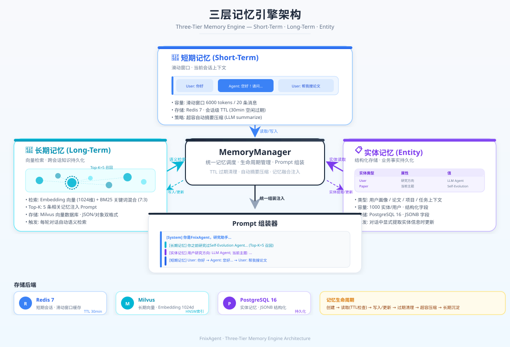
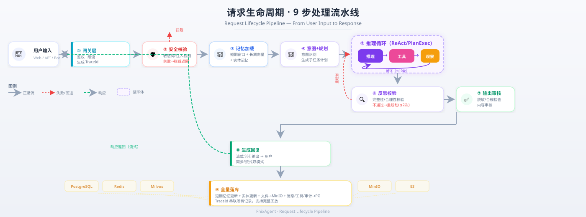
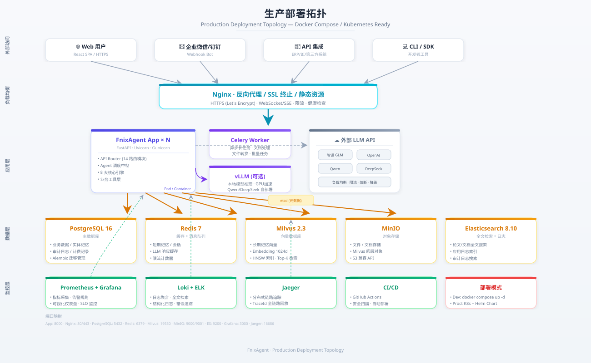
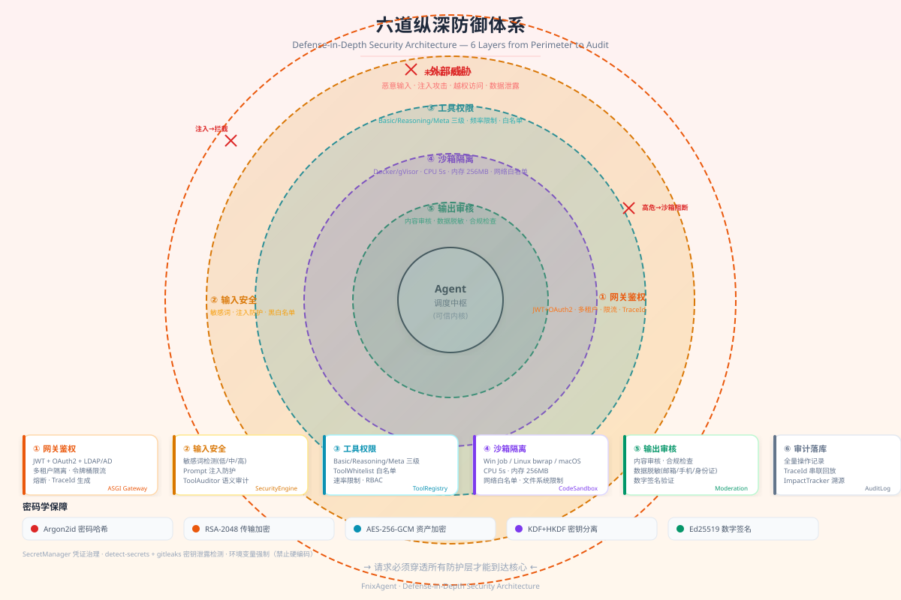

<p align="center">
  
</p>

---

# FnixAgent

<div align="center">

**智能办公 Agent — 自进化知识拓扑驱动的新一代 LLM Agent 框架**

[](https://github.com/Liuyifeidashuaibi/FnixAgent/actions/workflows/ci.yml)
[](LICENSE)
[](https://www.python.org/)
[](https://fastapi.tiangolo.com/)
[](https://langchain-ai.github.io/langgraph/)
[](https://github.com/Liuyifeidashuaibi/FnixAgent/actions/workflows/codeql.yml)

</div>

---

## 目录

- [项目简介](#项目简介)
- [核心设计理念](#核心设计理念)
- [架构总览](#架构总览)
- [自进化内核](#自进化内核)
- [核心能力矩阵](#核心能力矩阵)
- [快速开始](#快速开始)
- [API 参考](#api-参考)
- [配置指南](#配置指南)
- [部署方案](#部署方案)
- [安全纵深防御](#安全纵深防御)
- [可观测性](#可观测性)
- [插件生态](#插件生态)
- [开发指南](#开发指南)
- [项目结构](#项目结构)
- [技术选型](#技术选型)
- [路线图](#路线图)
- [社区与贡献](#社区与贡献)

---

## 项目简介

FnixAgent 是一个面向 **学习 / 教育 / 办公** 场景的智能 Agent 平台，构建于 **7 层架构 + 自进化内核** 之上。不同于传统 LLM 应用，FnixAgent 引入了 **KTG（知识拓扑图）+ STP（技能-拓扑突触协议）+ MFP（四阶进化飞轮）** 三大原创机制，实现 Agent 的持续自我进化——无需人工标注，系统在运行中自动积累知识、优化技能、迭代策略。

### 为什么选择 FnixAgent？

| 对比维度 | 传统 LLM Agent | FnixAgent |
|----------|---------------|-----------|
| 知识组织 | 向量相似度检索，存在语义漂移 | **KTG 权重路径搜索**，4 层结构化拓扑 |
| 技能调度 | 基于规则或 LLM 决策 | **STP 突触协议**，拓扑权重驱动优先级 |
| 长期进化 | 依赖人工标注与微调 | **MFP 四阶飞轮**，闭环自驱动 |
| 安全层次 | 输入层过滤 | **六道纵深防御**：网关→输入→权限→沙箱→输出→审计 |
| 可观测性 | 日志为主 | **全链路 TraceId**：消息→工具→反思→审计→计费完整回放 |
| 业务扩展 | 代码耦合 | **Tool Protocol 解耦**，换行业只需新增 `business/` 模块 |

---

## 核心设计理念

### 引擎与业务解耦

```
core/ (领域无关)  ←→  Tool Protocol  ←→  business/ (Office 领域)
```

- `core/` 不 import `business/`，业务以标准化「工具」注册
- 引擎只认 Tool Protocol，换行业零成本：新增 `business/` 模块即可
- 10 个核心引擎模块（LLM、记忆、推理、反思、工具、安全、Prompt、检索、沙箱、计费）全部可复用

### 三层记忆分工

```
短期记忆 (滑动窗口)  →  管 token 预算，控制上下文长度
长期记忆 (向量检索)  →  管跨会话知识，Milvus 持久化
实体记忆 (结构化)    →  管业务事实，用户画像/论文/项目
        ↓
   MemoryManager 统一注入 Prompt
```

<p align="center">
  
  <br>
  <em>三层记忆引擎架构 — 短期滑动窗口 · 长期向量检索 · 实体结构化记忆，MemoryManager 统一调度</em>
</p>

### 推理模式可插拔

```
简单任务  →  ReAct (轻量推理循环)
复杂任务  →  Plan & Execute (先规划再执行)
所有任务  →  Self-Reflection 叠加校验层
        ↓
   selector.py 按工具数/复杂度自动切换
```

---

## 架构总览

FnixAgent 采用 **7 层架构 + 调度中枢** 设计，自下而上为：

| 层 | 名称 | 职责 |
|----|------|------|
| ⑦ | 基础设施层 | Docker / K8s / vLLM / Prometheus+Grafana / ELK / Jaeger / CI/CD |
| ⑥ | 数据与存储层 | PostgreSQL 16 / Milvus / Redis 7 / MinIO / Elasticsearch |
| ⑤ | 业务能力层 | 论文检索 / Word 编辑 / 格式转换 / 图表生成 / PDF 生成 / 文档解析 / 学习辅助 |
| ④ | 核心算法引擎层 | LLM 服务 / 三层记忆 / 规划推理 / 反思纠错 / 工具平台 / 安全引擎 / Prompt 管理 / 向量检索 |
| ③ | Agent 调度中枢 | 生命周期总控：安全校验→记忆检索→意图识别→任务规划→推理循环→反思→输出 |
| ② | 网关层 | FastAPI + Nginx / JWT+OAuth2 / 多租户隔离 / 限流熔断 / 全链路 TraceId |
| ① | 交互层 | Web 前端 (React) / 企业微信/钉钉 Bot / CLI / ERP/BI 内嵌 / 开放 HTTP API |

### 一次完整请求的 9 步流水线

```
用户输入
  → 网关: 鉴权 + 限流 + 生成 traceId
  → 调度中枢:
      1. 安全校验(敏感词/注入检测) ─失败→ 拦截返回
      2. 短期记忆加载(滑动窗口) + 长期向量检索(召回相关历史/知识)
      3. 实体记忆读取(用户画像/当前任务上下文)
      4. 意图识别 → 选择推理模式(简单→ReAct / 复杂→Plan&Execute)
      5. 规划引擎生成子任务计划
      6. 循环: 推理 → 选择工具 → 沙箱安全执行 → 观察结果
      7. 反思引擎校验(完整性/合理性) ─不通过→ 重规划/补工具
      8. 输出审核(脱敏/合规) → 生成最终回复
      9. 短期记忆更新 + 实体记忆更新 + 文件落 MinIO + 记录落库
  → 交互层返回(流式 SSE)
```

> 完整架构可视化图见 [docs/architecture.svg](docs/architecture.svg) | 详细设计文档见 [ARCHITECTURE.md](ARCHITECTURE.md)

<p align="center">
  
  <br>
  <em>请求生命周期 9 步流水线 — 从用户输入到响应返回的完整处理链路</em>
</p>

---

## 自进化内核

FnixAgent 的核心差异化竞争力来自三大原创机制：

### KTG — 知识拓扑图 (Knowledge Topology Graph)

```
         L1: 目标层
        /    |    \
    L2: 概念1  概念2  概念3    ← 技能绑定层 (STP 接入点)
    /  \   |   /  \   |  \
L3: 规则1 规则2 规则3 规则4 规则5   ← 知识推理层
    |   |   |   |   |   |
L4: 事实1 事实2 事实3 事实4 事实5   ← 数据根基层
```

**为什么不用向量检索？** 传统 RAG 依赖向量相似度，高维空间中存在「语义漂移」——两个语义无关的文本可能因为共现词而产生高相似度。KTG 采用 **权重路径搜索**（BFS/DFS 在显式拓扑图中展开），每一步推理都有明确的语义依据。

- **4 层固定结构**：L1 目标 → L2 概念 → L3 规则 → L4 事实
- **自适应权重**：30 天衰减周期，命中强化 +0.1，长期不用权重衰减至 0.95 倍
- **规模上限**：50,000 节点，32 边/节点，防止图膨胀
- **持久化**：JSON/SQLite 双后端，每 100 次写入触发快照

### STP — 技能-拓扑突触协议 (Skill-Topology Protocol)

```
L2 概念节点 "论文检索"  ──权重 0.85──→ 技能 search_paper
                      ──权重 0.62──→ 技能 search_by_doi
                      ──权重 0.41──→ 技能 format_citation
```

技能绑定到 L2 概念节点，拓扑权重直接决定调度优先级。形成「概念→技能」的突触式连接——概念越活跃，关联技能越容易被激活。

- **三级权限**：Basic（自动调用）· Reasoning（需确认）· Meta（默认禁用）
- **反馈强化**：成功调用 +0.05 权重 · 失败调用 -0.1 权重
- **指数映射**：权重→优先级采用指数曲线，偏向高频技能
- **8 技能/概念上限**：防止单节点过载

### MFP — 四阶进化飞轮 (Multi-stage Flywheel Process)

```
    ┌──────────────┐
    │ ① 感知-执行   │  ← 多轮迭代，执行任务
    └──────┬───────┘
           ↓
    ┌──────────────┐
    │ ② 知识固化    │  ← 案例归并(相似度≥0.75)，规则提取
    └──────┬───────┘
           ↓
    ┌──────────────┐
    │ ③ 元反思      │  ← 每 10 任务反思，评分→重规划
    └──────┬───────┘
           ↓
    ┌──────────────┐
    │ ④ 爬山进化    │  ← 每 50 任务策略迭代，回退保护
    └──────────────┘
```

四个飞轮循环执行，形成自驱动闭环，无需人工标注即可持续优化。飞轮 4 具备回退保护——若新策略导致性能回退超过 5%，自动回滚到上一版本。

### 运行模式

通过环境变量 `FNIXAGENT_MODE` 控制：

| 模式 | 说明 |
|------|------|
| `legacy` | 传统 AgentScheduler 模式（默认） |
| `evolve` | 自进化模式，启用 KTG + STP + MFP |
| `both` | 双模运行，开发/对比场景 |

<p align="center">
  
  <br>
  <em>自进化内核三核协作原理 — KTG 知识拓扑 × STP 技能突触 × MFP 进化飞轮闭环</em>
</p>

---

## 核心能力矩阵

### 底层算法引擎 (领域无关，可复用)

| 引擎 | 核心能力 | 关键文件 |
|------|----------|----------|
| **LLM 基础服务** | 多模型路由（GLM/OpenAI/Qwen/DeepSeek）、负载均衡、令牌桶限流、Token 计费、LRU 缓存、异常熔断、3 级降级链 | `core/llm/` |
| **三层记忆引擎** | 短期滑动窗口（6000 tokens/20 条）、长期向量检索（Milvus Top-K 5）、实体结构化记忆（1000 条/用户）、TTL 过期清理 | `core/memory/` |
| **规划推理引擎** | ReAct（最大 10 轮）、Plan&Execute（工具数≥3 自动切换）、Self-Reflection 叠加校验、模式选择器 | `core/reasoning/` |
| **反思纠错引擎** | 完整性校验、逻辑校验、失败重规划（最多 2 次）、补工具建议 | `core/reflection/` |
| **工具执行平台** | 元数据注册中心、串/并/分支编排（最大 4 并行）、Docker/gVisor 沙箱隔离、超时 30s | `core/tools/` |
| **合规安全引擎** | 敏感词检测（低/中/高三级）、Prompt 注入防护、输出审核、数据脱敏（邮箱/手机/身份证） | `core/security/` |
| **Prompt 管理引擎** | 分层模板（角色/约束/工具/记忆/格式）、版本管理、动态组装 | `core/prompt/` |
| **向量检索引擎** | Embedding 封装（1024 维）、Milvus 抽象、向量+BM25 混合检索（7:3 权重） | `core/retrieval/` |

### 业务能力 (Office 领域)

| 模块 | 业务能力 | 依赖 |
|------|----------|------|
| **论文文献检索** | arXiv / Semantic Scholar / 知网万方 检索、去重、聚合 | ES + 各 API |
| **文献管理** | 引用格式化（BibTeX/GB-T7714）、文献综述生成、相关性分析 | LLM + 结构化 |
| **Word 编辑** | 创建/修改 docx、查找替换、样式/目录/页眉页脚、批注修订 | python-docx |
| **格式转换** | docx ↔ pdf ↔ markdown ↔ html ↔ txt 双向转换 | pandoc / libreoffice |
| **图表生成** | 柱/折线/饼/散点/热力图、数据可视化 | matplotlib / plotly |
| **PDF 生成** | 报告/简历/学术论文 PDF（含 LaTeX 路线） | reportlab / weasyprint |
| **文档解析** | PDF/Word/图片 表格抽取、OCR、公式识别（多模态） | unpdf / paddle |
| **学习辅助** | 论文摘要、问答、笔记生成、抽认卡、概念图 | LLM + 记忆 |
| **Office 任务编排** | 端到端工作流：搜论文→下载→总结→生成 Word→转 PDF | 编排引擎 |

---

## 快速开始

### 环境要求

- Python 3.11+
- Docker & Docker Compose（推荐）
- 至少一个 LLM API Key（GLM / OpenAI / DeepSeek / Qwen）

### 方式一：Docker 一键启动（推荐）

```bash
# 克隆项目
git clone https://github.com/Liuyifeidashuaibi/FnixAgent.git
cd FnixAgent

# 配置环境变量
cp .env.example .env
# 编辑 .env，至少填入 GLM_API_KEY 或 OPENAI_API_KEY

# 启动完整环境（PostgreSQL + Redis + Milvus + MinIO + Elasticsearch + App）
docker compose up -d --build

# 初始化数据库
make migrate

# 导入种子数据（工具元数据）
make seed
```

### 方式二：本地开发启动

```bash
# 安装依赖
pip install -r requirements.txt
pip install -e ".[dev,security]"

# 配置环境变量
cp .env.example .env

# 启动开发服务器
make run
# 或直接: python -m uvicorn fnixagent.main:app --host 0.0.0.0 --port 8000 --reload
```

### 验证服务

```bash
# 健康检查
curl http://localhost:8000/health

# 查看 API 文档
open http://localhost:8000/docs

# 获取运行统计
curl http://localhost:8000/stats
```

---

## API 参考

### 路由总览

| 路由前缀 | 功能 | 说明 |
|----------|------|------|
| `/api/v1/auth/*` | 用户鉴权 | 注册/登录/JWT 认证/Token 刷新 |
| `/api/v1/chat/*` | Agent 对话 | 同步对话/流式 SSE 输出 |
| `/api/v1/chat_agent/*` | 自进化对话 | 基于 KTG+STP+MFP 的进化对话 |
| `/api/v1/documents/*` | 文档管理 | 上传/查询/处理/下载 |
| `/api/v1/tasks/*` | 任务管理 | 创建/查询/取消/重试 |
| `/api/v1/tools/*` | 工具管理 | 注册/查询/执行/统计 |
| `/api/v1/admin/*` | 管理后台 | 系统配置/用户管理 |
| `/api/v1/rbac/*` | 权限管理 | 角色/权限/资源 |
| `/api/v1/audit/*` | 审计日志 | 操作审计/安全审计 |
| `/api/v1/privacy/*` | 隐私管理 | 数据导出/账号注销 |
| `/api/v1/dashboard/*` | 仪表盘 | 统计看板/监控数据 |
| `/api/v1/agentos/*` | Agent OS | Agent 运行时管理 |
| `/api/v1/coding/*` | 编码辅助 | 代码生成/审查 |

### 基础端点

| 端点 | 方法 | 说明 |
|------|------|------|
| `/` | GET | 服务基本信息 |
| `/health` | GET | 健康检查 |
| `/stats` | GET | Agent 运行统计 |
| `/docs` | GET | Swagger API 文档 |

### 流式对话示例

```python
import httpx

async def stream_chat(message: str):
    async with httpx.AsyncClient() as client:
        async with client.stream(
            "POST",
            "http://localhost:8000/api/v1/chat/stream",
            json={"message": message, "session_id": "my-session"},
            headers={"Authorization": "Bearer YOUR_JWT_TOKEN"}
        ) as response:
            async for chunk in response.aiter_text():
                print(chunk, end="", flush=True)
```

---

## 配置指南

### 环境变量

| 变量 | 说明 | 必需 | 默认值 |
|------|------|------|--------|
| `POSTGRES_PASSWORD` | PostgreSQL 密码 | ✅ | - |
| `REDIS_PASSWORD` | Redis 密码 | ✅ | - |
| `MINIO_ACCESS_KEY` | MinIO 访问密钥 | ✅ | - |
| `MINIO_SECRET_KEY` | MinIO 密钥 | ✅ | - |
| `GLM_API_KEY` | GLM API 密钥 | ✅ | - |
| `JWT_SECRET_KEY` | JWT 签名密钥 | ✅ | - |
| `ES_PASSWORD` | Elasticsearch 密码 | ✅ | - |
| `OPENAI_API_KEY` | OpenAI API 密钥 | ❌ | - |
| `QWEN_API_KEY` | Qwen API 密钥 | ❌ | - |
| `DEEPSEEK_API_KEY` | DeepSeek API 密钥 | ❌ | - |
| `FNIXAGENT_MODE` | 运行模式 | ❌ | `legacy` |
| `SERVICE_ENV` | 运行环境 | ❌ | `development` |

### 嵌套配置覆盖

支持通过环境变量覆盖任意配置项，格式为 `FNIXAGENT_<模块>__<字段>`：

```bash
# 覆盖 LLM 缓存开关
export FNIXAGENT_LLM__CACHE_ENABLED="false"

# 覆盖记忆检索 Top-K
export FNIXAGENT_MEMORY__LONG_TERM_TOP_K="10"

# 覆盖推理最大迭代次数
export FNIXAGENT_REASONING__MAX_REASONING_ITERATIONS="15"

# 覆盖飞轮进化检查间隔
export FNIXAGENT_FLYWHEEL__EVOLUTION_CHECK_INTERVAL="100"
```

### YAML 配置文件

[config/settings.yaml](config/settings.yaml) 包含完整的可配置项，包括：
- 服务基础配置（端口/Worker/调试）
- 数据库连接池配置
- LLM 多 Provider 路由策略
- 记忆三层参数
- 安全等级与脱敏规则
- 自进化拓扑/技能/飞轮参数
- 资产加密与存储
- 监控与链路追踪

---

## 部署方案

### 开发环境

```bash
make deploy          # docker compose up -d --build
make deploy-ps       # 查看服务状态
make deploy-logs     # 查看日志
make deploy-down     # 停止服务（保留数据）
```

### 生产环境

```bash
# 生成随机密码
make gen-secrets

# 编辑 .env.prod，填入 LLM API 密钥
vim .env.prod

# 一键启动生产环境（含 Nginx + HTTPS）
make deploy-prod

# 初始化数据库
docker compose -f deploy/docker/docker-compose.prod.yml exec fnixagent alembic upgrade head
```

### Kubernetes 部署

```bash
# 使用 Helm Chart
helm install fnixagent deploy/helm/fnixagent \
  --set secrets.glmApiKey=YOUR_KEY \
  --set ingress.host=fnixagent.example.com
```

### 服务依赖拓扑

```
fnixagent-app
  ├── postgres:5432     (PostgreSQL 16)
  ├── redis:6379        (Redis 7)
  ├── milvus:19530      (Milvus 向量数据库)
  │   ├── etcd:2379     (Milvus 元数据)
  │   └── minio:9000    (Milvus 对象存储)
  ├── minio:9000        (业务文件存储)
  └── elasticsearch:9200 (全文检索)
```

<p align="center">
  
  <br>
  <em>生产部署拓扑 — Nginx 负载均衡 · FnixAgent 多副本 · 5 大数据组件 · 全栈监控</em>
</p>

---

## 安全纵深防御

FnixAgent 实现 **六道安全防线**，从外到内层层防护：

```
① 网关鉴权    →  JWT + OAuth2 + 多租户隔离 + 限流熔断
② 输入安全    →  敏感词检测(低/中/高) + Prompt 注入防护 + 黑名单/白名单
③ 工具权限    →  Basic/Reasoning/Meta 三级分级 + 调用频率限制
④ 沙箱隔离    →  Docker/gVisor 容器隔离 + CPU 5s 限制 + 内存 256MB 上限 + 网络白名单
⑤ 输出审核    →  内容审核 + 数据脱敏(邮箱/手机/身份证) + 合规检查
⑥ 审计落库    →  全量操作记录 + TraceId 串联 + 不可篡改审计日志
```

### 密码学保障

| 场景 | 算法 | 说明 |
|------|------|------|
| 密码哈希 | Argon2id | 抗 GPU/ASIC 破解 |
| 传输加密 | RSA-2048 | 密码传输端到端加密 |
| 资产加密 | AES-256-GCM | 认证加密，防篡改 |
| 密钥派生 | KDK (KDF + HKDF-SHA256) | 主密钥与数据密钥分离 |
| 数字签名 | Ed25519 | 资产完整性校验 |

<p align="center">
  
  <br>
  <em>六道纵深防御体系 — 洋葱模型：从网关鉴权到审计落库，层层拦截外部威胁</em>
</p>

---

## 可观测性

### 全链路追踪

每个请求生成唯一 `traceId`，贯穿整个调用链：

```
traceId: "a1b2c3d4"
  ├── message 记录 (对话内容)
  ├── tool_execution 记录 (工具调用)
  ├── reflection_log 记录 (反思校验)
  ├── audit_log 记录 (安全审计)
  └── billing_record 记录 (Token 计费)
```

任一请求可完整回放，支撑案例回流与持续优化。

### 监控栈

| 组件 | 用途 |
|------|------|
| **Prometheus** | 指标采集（请求量/延迟/错误率/Token 消耗） |
| **Grafana** | 可视化仪表盘 |
| **Loki** | 日志聚合 |
| **Jaeger** | 分布式链路追踪 |
| **ELK** | 全文检索与日志分析 |

### 关键指标

```bash
# Prometheus 指标端点
curl http://localhost:8000/metrics

# 应用运行统计
curl http://localhost:8000/stats
```

---

## 插件生态

### DocumentConverter 协议

统一的文档转换抽象接口，第三方可通过入口点注册：

```python
# 在 pyproject.toml 中声明
[project.entry-points."fnixagent.converters"]
my_converter = "my_package:MyConverter"

# 实现协议
from fnixagent.business.converter.protocol import DocumentConverter, QualityTier

class MyConverter(DocumentConverter):
    quality_tier = QualityTier.BALANCED

    async def convert(self, source: bytes, target_format: str) -> bytes:
        ...
```

### 三层质量梯度

| 梯度 | 说明 | 适用场景 |
|------|------|----------|
| `fast` | 快速转换，牺牲精度换速度 | 预览、批量处理 |
| `balanced` | 平衡质量与速度（默认） | 通用场景 |
| `hi_res` | 高精度转换，保留格式细节 | 正式文档、学术论文 |

### 插件入口点

- `fnixagent.converters` — 文档转换器
- `fnixagent.tools` — 业务工具
- `fnixagent.middleware` — 中间件

---

## 开发指南

### 代码质量

```bash
make lint      # Ruff 检查 + Pyright 类型检查 (strict 模式)
make format    # Ruff 自动格式化 + 修复
make test      # 运行所有测试
make test-cov  # 测试 + 覆盖率报告
```

### 数据库迁移

```bash
make migrate              # 应用所有未执行迁移
make migrate-create m="描述"  # 自动检测模型变化并生成迁移
make migrate-downgrade    # 回滚一个版本
make migrate-current      # 查看当前版本
make migrate-history      # 查看迁移历史
```

### 测试结构

```
tests/
├── unit/          # 单元测试
│   ├── test_llm/
│   ├── test_memory/
│   ├── test_reasoning/
│   └── test_tools/
├── integration/   # 集成测试
├── e2e/           # 端到端测试
├── security/      # 安全测试（注入攻击等）
└── load/          # 压力测试 (Locust)
```

### 开发工具链

| 工具 | 用途 | 配置 |
|------|------|------|
| **Ruff** | Lint + 格式化 | 行宽 100，双引号 |
| **Pyright** | 类型检查 | strict 模式 |
| **Pytest** | 测试框架 | 7.0+，含覆盖率 |
| **Hatchling** | 构建后端 | PEP 621 标准 |

---

## 项目结构

```
FnixAgent/
├── ARCHITECTURE.md              # 架构设计文档
├── README.md                    # 本文件
├── CHANGELOG.md                 # 变更日志
├── CONTRIBUTING.md              # 贡献指南
├── SECURITY.md                  # 安全策略
├── DEVELOPMENT.md               # 开发指南
├── pyproject.toml               # 项目元数据与工具链配置
├── docker-compose.yml           # 开发环境 Docker 编排
├── Dockerfile
├── .env.example
├── Makefile
│
├── docs/
│   └── architecture.svg         # 架构可视化图
│
├── config/
│   ├── settings.yaml            # 全局配置
│   ├── prompts/                 # 分层 Prompt 模板
│   │   ├── system_role.yaml
│   │   ├── react_planner.yaml
│   │   ├── plan_execute.yaml
│   │   └── reflection.yaml
│   └── security/                # 敏感词表/黑白名单
│
├── src/fnixagent/
│   ├── main.py                  # FastAPI 入口
│   ├── core/
│   │   ├── orchestrator/        # Agent 调度中枢
│   │   ├── llm/                 # LLM 基础服务层
│   │   ├── memory/              # 三层记忆引擎
│   │   ├── reasoning/           # 规划与推理引擎
│   │   ├── reflection/          # 反思纠错引擎
│   │   ├── tools/               # 工具执行平台
│   │   ├── security/            # 合规与安全引擎
│   │   ├── prompt/              # Prompt 管理引擎
│   │   └── retrieval/           # 向量检索引擎
│   ├── business/                # 业务能力层
│   │   ├── search/              # 论文文献检索
│   │   ├── literature/          # 文献管理
│   │   ├── word/                # Word 编辑
│   │   ├── converter/           # 格式转换
│   │   ├── chart/               # 图表生成
│   │   ├── pdf/                 # PDF 生成
│   │   ├── parser/              # 文档解析
│   │   ├── learning/            # 学习辅助
│   │   └── workflow/            # Office 任务编排
│   ├── api/                     # API 接口层
│   │   ├── routers/             # 14 个路由模块
│   │   ├── middleware.py        # 中间件
│   │   └── schemas/             # Pydantic 模型
│   ├── adapters/                # 外部依赖适配器（防腐层）
│   │   ├── db/                  # PostgreSQL
│   │   ├── cache/               # Redis
│   │   ├── objectstore/         # MinIO
│   │   ├── search_engine/       # Elasticsearch
│   │   └── queue/               # Celery
│   ├── models/                  # 领域模型 + ORM
│   └── tasks/                   # 异步长任务
│
├── deploy/                      # 部署配置
│   ├── docker/                  # Dockerfile
│   ├── k8s/                     # Kubernetes 资源
│   └── helm/                    # Helm Chart
│
├── migrations/                  # 数据库迁移 (Alembic)
├── scripts/                     # 运维脚本
├── tests/                       # 测试
└── assets/                      # 自进化资产
    ├── topology/                # 拓扑图快照
    ├── skills/                  # 技能绑定
    ├── flywheel/                # 飞轮状态
    ├── traces/                  # 执行轨迹
    ├── snapshots/               # 系统快照
    └── prompts/                 # 进化 Prompt
```

---

## 技术选型

| 层级 | 选型 | 版本 |
|------|------|------|
| 后端语言 | Python | 3.11+ |
| Web 框架 | FastAPI | 0.104 |
| Agent 编排 | 自研调度器 + LangGraph | 0.2.0+ |
| LLM Provider | GLM / OpenAI / Qwen / DeepSeek | - |
| 业务数据库 | PostgreSQL | 16 |
| 向量数据库 | Milvus | 2.3 |
| 缓存 | Redis | 7 |
| 对象存储 | MinIO | latest |
| 搜索引擎 | Elasticsearch | 8.10 |
| 任务队列 | Celery | - |
| 容器化 | Docker + Kubernetes | - |
| 监控 | Prometheus + Grafana + Jaeger | - |
| 密码学 | Argon2id + RSA-2048 + AES-256-GCM | - |
| 构建 | Hatchling (PEP 621) | - |
| Lint | Ruff + Pyright (strict) | - |
| CI/CD | GitHub Actions | - |

---

## 路线图

### v1.1.0 (当前版本)

- [x] Apache 2.0 协议迁移
- [x] OS 级执行沙箱 (Windows/Linux/macOS)
- [x] 工具语义审计层 (ToolAuditor)
- [x] 影响溯源系统 (ImpactTracker + 回滚)
- [x] 凭证治理 (SecretManager)
- [x] KDK 密钥分离 (KDF + HKDF-SHA256)
- [x] 注入检测 (InjectionDetector)
- [x] 工具白名单 (ToolWhitelist)
- [x] 数字签名 (资产完整性校验)
- [x] DocumentConverter 协议 + 插件生态
- [x] Ruff + Pyright 工具链迁移

### v1.2.0 (计划中)

- [ ] 多 Agent 协作 (AgentOS 完整实现)
- [ ] WebSocket 双向通信
- [ ] 知识图谱可视化面板
- [ ] MCP 协议完整支持
- [ ] 飞轮进化效果 A/B 评估框架

### v2.0.0 (远期)

- [ ] 跨语言 SDK (TypeScript / Go)
- [ ] 联邦学习隐私保护
- [ ] 企业级 SSO 全家桶 (SAML / OIDC / LDAP)
- [ ] 多模态能力（图像理解 / 语音交互）

---

## 社区与贡献

### 贡献指南

我们欢迎所有形式的贡献！请参阅 [CONTRIBUTING.md](CONTRIBUTING.md) 了解详细流程。

### 行为准则

本项目遵循 [贡献者公约](CODE_OF_CONDUCT.md)，请所有参与者共同维护开放、友好的社区环境。

### 安全漏洞报告

请勿在公开 Issue 中报告安全漏洞。请参阅 [SECURITY.md](SECURITY.md) 了解安全报告流程。

### 相关文档

- [ARCHITECTURE.md](ARCHITECTURE.md) — 完整架构设计文档，含数据库表结构
- [DEVELOPMENT.md](DEVELOPMENT.md) — 开发环境搭建与调试指南
- [CHANGELOG.md](CHANGELOG.md) — 版本变更日志
- [docs/architecture.svg](docs/architecture.svg) — 架构可视化图

### 许可证

本项目采用 **Apache License 2.0** 开源协议。详见 [LICENSE](LICENSE)。

Apache 2.0 相比 MIT 提供了专利授权条款和更完善的责任限制，更适合企业级项目使用。

### 联系方式

- **项目主页**: [github.com/Liuyifeidashuaibi/FnixAgent](https://github.com/Liuyifeidashuaibi/FnixAgent)
- **问题反馈**: [github.com/Liuyifeidashuaibi/FnixAgent/issues](https://github.com/Liuyifeidashuaibi/FnixAgent/issues)
- **讨论**: [github.com/Liuyifeidashuaibi/FnixAgent/discussions](https://github.com/Liuyifeidashuaibi/FnixAgent/discussions)

---

<div align="center">

**Made with passion by the FnixAgent Team**

</div>