# FnixAgent 智能工作台系统 V1.0 用户手册

> **页眉格式说明（打印/PDF 导出时使用）：** 每页页眉标注"FnixAgent 智能工作台系统 V1.0 用户手册"，页脚标注页码。A4 纸纵向排版，每页不少于 30 行文字。

**软件名称**：FnixAgent 智能工作台系统  
**软件版本**：V1.0  
**文档版本**：V1.0  
**编写日期**：2026 年 08 月  

---

## 目录

- [第一章 软件概述](#第一章-软件概述)
  - [1.1 产品定位](#11-产品定位)
  - [1.2 核心能力](#12-核心能力)
  - [1.3 技术架构](#13-技术架构)
- [第二章 运行环境](#第二章-运行环境)
  - [2.1 硬件要求](#21-硬件要求)
  - [2.2 软件环境](#22-软件环境)
  - [2.3 操作系统要求](#23-操作系统要求)
- [第三章 安装与配置](#第三章-安装与配置)
  - [3.1 下载安装](#31-下载安装)
  - [3.2 首次配置](#32-首次配置)
  - [3.3 API Key 设置](#33-api-key-设置)
- [第四章 功能模块详述](#第四章-功能模块详述)
  - [4.1 Work 模式](#41-work-模式)
  - [4.2 Code 模式](#42-code-模式)
  - [4.3 Harness 管理](#43-harness-管理)
  - [4.4 安全机制](#44-安全机制)
  - [4.5 自进化内核](#45-自进化内核)
  - [4.6 AG-UI 事件流](#46-ag-ui-事件流)
- [第五章 操作流程](#第五章-操作流程)
  - [5.1 典型使用场景](#51-典型使用场景)
  - [5.2 操作步骤](#52-操作步骤)
- [第六章 常见问题与故障排除](#第六章-常见问题与故障排除)
- [第七章 技术支持信息](#第七章-技术支持信息)

---

## 第一章 软件概述

### 1.1 产品定位

FnixAgent 智能工作台系统 V1.0（以下简称"FnixAgent"）是一款**本地优先（Local-First）的 AI 工作台软件**，面向个人办公、学习辅助和本地编程场景，将大语言模型（LLM）能力直接部署在用户本机，提供开箱即用的智能任务执行体验。

FnixAgent 的核心设计理念包括以下四个方面：

1. **无账号体系**：软件打开即可使用，无需注册账号、绑定手机号或第三方登录。所有用户数据、会话记录和配置信息均保存在本机，不依赖任何云端账户系统。

2. **BYOK（Bring Your Own Key）模式**：用户需自行提供大语言模型的 API Key（如 OpenAI、通义千问 Qwen、智谱 GLM、DeepSeek 等服务商的密钥），密钥安全保存在本机 `~/.fnix` 目录下。软件本身不内置任何 LLM 服务，不代为调用，确保用户对 API 调用与费用拥有完全控制权。

3. **双模合一**：在同一工作台界面中，提供 **Work（办公任务）** 与 **Code（编程辅助）** 两种工作模式，共用同一工作区目录与会话状态，无需切换应用。

4. **自进化内核**：内置三大原创机制——知识拓扑图（KTG）、技能突触协议（STP）、四阶进化飞轮（MFP），使系统能够在使用过程中持续学习、优化推理路径与工具选择策略。

### 1.2 核心能力

FnixAgent 的核心能力涵盖以下六大模块：

| 能力模块 | 功能说明 |
|---------|---------|
| **Work 模式** | 办公任务流式执行，支持生成 Word 文档（.docx）、Excel 表格（.xlsx）、PDF 报告、图表、Markdown 文件等多种产物。通过自然语言描述任务需求，Agent 自动规划执行步骤并产出最终文件。 |
| **Code 模式** | 面向本地编程项目的智能辅助，支持 Agent 规划/执行/审查三阶段工作流。通过 `@file` 语法引用项目文件，生成代码差异（Diff）预览，用户确认后（Accept）写入磁盘。 |
| **Harness 管理** | 会话（Session）持久化、MCP（Model Context Protocol）配置管理、工作区 `.fnix` 目录布局自动初始化、项目技能（Skills）热加载。 |
| **安全机制** | JWT 鉴权、Prompt 注入防护、敏感词检测、沙箱命令执行、全链路审计日志、数据脱敏处理。 |
| **AG-UI 事件流** | 基于 Server-Sent Events（SSE）的实时事件流推送，前端可实时展示 Agent 的思考过程、工具调用、产物生成等步骤。 |
| **自进化内核** | KTG 路径搜索替代纯向量 RAG 检索、STP 技能权重驱动工具优先级排序、MFP 四阶段进化（感知执行→知识固化→元反思→爬山进化）。 |

### 1.3 技术架构

FnixAgent 采用**三进程架构**设计，各进程职责明确、独立运行，通过 HTTP 协议进行通信。

#### 1.3.1 架构总览

```
Desktop (Tauri 2)  →  agentd :8003  →  fnix-local :8710
        ↘ ~/.fnix + {workspace}/.fnix
```

| 进程 | 默认端口 | 职责说明 |
|------|---------|---------|
| **Desktop（Tauri 2）** | — | 桌面前端 UI，负责 Work/Code 界面渲染、IPC 通信、伪终端（PTY）管理、BYOK 密钥设置界面、本地文件系统交互。 |
| **fnix-agentd** | 8003 | Python 后端服务，是系统的"大脑"。负责 KTG/STP/MFP 自进化引擎运转、Work 与 Code 任务的核心调度编排、LLM 调用路由、记忆管理、安全校验。 |
| **fnix-local** | 8710 | 本地算力 sidecar 进程，负责项目文件索引、程序依赖图（PDG）构建、沙箱命令执行。fnix-local 离线时 Work/Code 可降级使用 Python 内置工具继续运行。 |

#### 1.3.2 技术栈

| 层级 | 技术选型 | 说明 |
|------|---------|------|
| 桌面框架 | Tauri 2 | 轻量级跨平台桌面应用框架，基于 Rust，前端使用 Web 技术 |
| 前端框架 | React 19 + TypeScript | 单页应用架构，配合 Zustand 状态管理 |
| UI 样式 | Tailwind CSS 4 | 原子化 CSS 框架 |
| 代码编辑器 | Monaco Editor | VS Code 同源编辑器内核 |
| 终端模拟 | xterm.js | 前端伪终端组件 |
| 后端语言 | Python 3.11+ | 异步编程生态完善，LLM 生态友好 |
| 后端框架 | FastAPI + Uvicorn | 高性能异步 Web 框架，支持自动 OpenAPI 文档 |
| Agent 编排 | LangGraph + 自研调度器 | ReAct / Plan&Execute / Self-Reflection 三模式可插拔 |
| LLM 接入 | OpenAI SDK 兼容协议 | 支持 OpenAI / Qwen / GLM / DeepSeek 等多种提供商 |
| 加密算法 | Argon2id + RSA + AES-256-GCM | 密码哈希、非对称加密、对称加密三层加密体系 |
| 本地 sidecar | Rust（fnix-local） | 高性能本地索引与沙箱执行 |
| 包管理 | pnpm 9 + pip + Cargo | Monorepo 多语言包管理 |

#### 1.3.3 目录约定

**用户级目录 `~/.fnix/`（或通过 `FNIX_HOME` 环境变量自定义）**

| 路径 | 用途 |
|------|------|
| `config.toml` | LLM 提供商、模型名称等配置 |
| `mcp.json` | MCP Server 配置列表 |
| `sessions/*.json` | Work 与 Code 任务会话持久化记录 |
| `logs/` | 本地运行日志 |

**项目级目录 `{workspace}/.fnix/`（打开工作区文件夹时自动创建）**

| 路径 | 用途 |
|------|------|
| `skills/*.md` | 项目自定义技能文件（注入 STP 与 Prompt） |
| `artifacts/` | Work 模式产物推荐输出目录 |
| `index/` | fnix-local 构建的程序依赖图索引 |
| `topology/` | KTG 知识拓扑图项目级缓存 |
| `rules.md` | 项目规则文件（兼容 AGENTS.md 规范） |

---

## 第二章 运行环境

### 2.1 硬件要求

FnixAgent 作为本地 AI 工作台，其计算负载主要在 LLM 远程调用与本地文件处理上，对本地硬件要求适中。

**最低硬件配置**

| 硬件项 | 最低要求 |
|--------|---------|
| CPU | 双核 x86-64 处理器，主频 2.0 GHz 及以上 |
| 内存 | 4 GB RAM |
| 磁盘空间 | 2 GB 可用空间（安装程序 + 运行时缓存） |
| 网络 | 可访问互联网（用于调用 LLM API） |

**推荐硬件配置**

| 硬件项 | 推荐配置 |
|--------|---------|
| CPU | 四核及以上 x86-64 处理器，主频 2.5 GHz 及以上 |
| 内存 | 8 GB RAM 及以上 |
| 磁盘空间 | 10 GB 可用空间（含项目工作区、缓存与产物空间） |
| 网络 | 稳定的宽带网络连接（LLM 流式响应需持续网络） |
| 显示器 | 分辨率 1366×768 及以上（推荐 1920×1080 全高清） |

> **说明**：若使用 Code 模式的大型项目索引功能（fnix-local PDG 构建），建议内存不低于 8 GB 以保证索引性能。开发编译场景（从源码构建）需额外磁盘空间。

### 2.2 软件环境

**运行时依赖（安装包用户自动包含）**

| 软件组件 | 版本 | 用途 |
|---------|------|------|
| Tauri Runtime | 2.x | 桌面应用运行时（安装包内嵌 WebView2 / WebKit） |
| Python Runtime | 3.11+ | agentd 后端运行时（安装包内嵌或 Sidecar 打包） |
| WebView2（Windows） | 最新版 | Windows 平台 Tauri 前端渲染引擎 |
| WebKit（macOS/Linux） | 系统内置 | macOS/Linux 平台 Tauri 前端渲染引擎 |

**从源码构建的额外依赖（仅开发者）**

| 软件组件 | 版本 | 用途 |
|---------|------|------|
| Node.js | 18.12+ | 前端构建与开发工具链 |
| pnpm | 9.15+ | Monorepo 包管理器 |
| Rust Toolchain | stable | Tauri 桌面框架与 fnix-local 编译 |
| Python | 3.11+ | agentd 后端开发 |
| Windows Build Tools | 最新 | Windows 平台编译 Tauri 所需（VS Build Tools） |

**LLM 服务**

用户需自行拥有至少一个以下大语言模型服务的 API Key：

| 服务商 | 支持状态 | 配置标识 |
|--------|---------|---------|
| OpenAI | 支持 | `OPENAI_API_KEY` |
| 阿里通义千问（Qwen / DashScope） | 支持 | `DASHSCOPE_API_KEY` / `QWEN_API_KEY` |
| 智谱 AI（GLM） | 支持 | `GLM_API_KEY` |
| DeepSeek | 支持 | `DEEPSEEK_API_KEY` |
| 自定义兼容端点 | 支持 | `CUSTOM_API_KEY` + `CUSTOM_BASE_URL` |

### 2.3 操作系统要求

FnixAgent 支持三大主流操作系统，安装包格式因平台而异：

| 操作系统 | 最低版本 | 安装包格式 | 备注 |
|---------|---------|-----------|------|
| **Windows** | Windows 10 (1809) 及以上 | `.exe`（NSIS 安装程序） | 需 WebView2 Runtime（Windows 10/11 通常已预装） |
| **macOS** | macOS 11 (Big Sur) 及以上 | `.dmg`（磁盘映像） | 支持 Intel 与 Apple Silicon（M1/M2/M3） |
| **Linux** | Ubuntu 20.04 及以上或等效发行版 | `.deb` / AppImage | 需 WebKit2GTK 运行时库 |

> **架构支持**：Windows 支持 x86-64 架构；macOS 同时支持 x86-64 与 ARM64（Apple Silicon）；Linux 支持 x86-64 架构。

---

## 第三章 安装与配置

### 3.1 下载安装

FnixAgent 提供两种安装方式：**下载预编译安装包**（推荐最终用户）和**从源码构建**（适合开发者与贡献者）。

#### 3.1.1 方式一：下载安装包（推荐）

**步骤 1：下载安装包**

前往 FnixAgent 官方 GitHub Releases 页面：

```
https://github.com/Liuyifeidashuaibi/FnixAgent/releases
```

根据您的操作系统选择对应安装包：

| 操作系统 | 安装包文件 |
|---------|-----------|
| Windows | `FnixAgent_x.x.x_x64-setup.exe` |
| macOS (Intel) | `FnixAgent_x.x.x_x64.dmg` |
| macOS (Apple Silicon) | `FnixAgent_x.x.x_aarch64.dmg` |
| Linux (Debian) | `FnixAgent_x.x.x_amd64.deb` |
| Linux (AppImage) | `FnixAgent_x.x.x_amd64.AppImage` |

**步骤 2：安装**

- **Windows**：双击 `.exe` 安装程序，按向导完成安装。如遇 SmartScreen 提示，点击"仍要运行"。
- **macOS**：双击 `.dmg` 文件，将 FnixAgent 图标拖入 Applications 文件夹。首次打开时如遇"无法验证开发者"提示，前往系统偏好设置 → 安全性与隐私 → 允许打开。
- **Linux（.deb）**：执行 `sudo dpkg -i FnixAgent_x.x.x_amd64.deb`，如缺依赖执行 `sudo apt --fix-broken install`。
- **Linux（AppImage）**：赋予执行权限 `chmod +x FnixAgent_x.x.x_amd64.AppImage`，双击或命令行运行。

**步骤 3：启动**

安装完成后，从开始菜单（Windows）、Launchpad（macOS）或应用列表（Linux）启动 FnixAgent。

> 安装包内已包含运行所需的全部组件（Tauri Runtime、Python Runtime、agentd、fnix-local），无需额外安装依赖。

#### 3.1.2 方式二：从源码构建（开发者）

**前置条件**

确保已安装以下开发工具：

| 工具 | 版本要求 | 安装方式 |
|------|---------|---------|
| Git | 任意版本 | [git-scm.com](https://git-scm.com/) |
| Node.js | 18.12+ | [nodejs.org](https://nodejs.org/) |
| pnpm | 9.15+ | `npm install -g pnpm` |
| Python | 3.11+ | [python.org](https://www.python.org/) |
| Rust | stable | [rustup.rs](https://rustup.rs/) |

Windows 平台还需安装 Visual Studio Build Tools（含 C++ 桌面开发工作负载），用于编译 Tauri 框架。详见 Tauri 官方前置条件指南：`https://v2.tauri.app/start/prerequisites/`

**克隆与安装**

```bash
# 克隆仓库
git clone https://github.com/Liuyifeidashuaibi/FnixAgent.git
cd FnixAgent

# 复制环境变量模板
cp .env.example .env

# Windows 安装脚本
powershell -ExecutionPolicy Bypass -File install.ps1

# macOS / Linux 安装脚本
chmod +x install.sh && ./install.sh

# 或使用 pnpm 一键安装依赖
pnpm setup
```

**环境检查**

```bash
pnpm doctor
```

该命令会自动检查 Node.js、pnpm、Python、Rust 等工具的版本与可用性，并报告缺失项。

**启动开发模式**

```bash
# 方式一：启动三进程（Tauri + agentd:8003 + fnix-local:8710）
pnpm dev:all

# 方式二：仅启动 Tauri Desktop（自动 spawn 后端）
pnpm dev
```

启动后，Tauri 桌面窗口自动打开。API 健康检查地址：`http://127.0.0.1:8003/health`

### 3.2 首次配置

首次启动 FnixAgent 桌面应用后，系统将显示**首次引导向导**，引导用户完成以下配置：

**引导步骤 1：选择工作模式**

系统提示选择主要使用场景：
- **Work 模式** — 办公任务（文档生成、表格处理、PDF 制作等）
- **Code 模式** — 编程辅助（代码修改、项目重构、Bug 修复等）
- **两者兼用** — 同时使用办公与编程功能（默认推荐）

> 此选择仅影响初始界面布局，后续可随时在界面顶部切换 Work / Code 模式。

**引导步骤 2：配置 API Key**

详见下一节 [3.3 API Key 设置](#33-api-key-设置)。

**引导步骤 3：选择工作区文件夹**

点击"选择文件夹"按钮，在系统文件对话框中选择一个本地目录作为工作区（Workspace）。系统将自动在该目录下创建 `.fnix/` 隐藏文件夹，用于存储项目技能、产物输出、索引缓存等数据。

**引导步骤 4：完成**

配置完成后，进入主工作台界面，即可开始使用 Work 或 Code 功能。

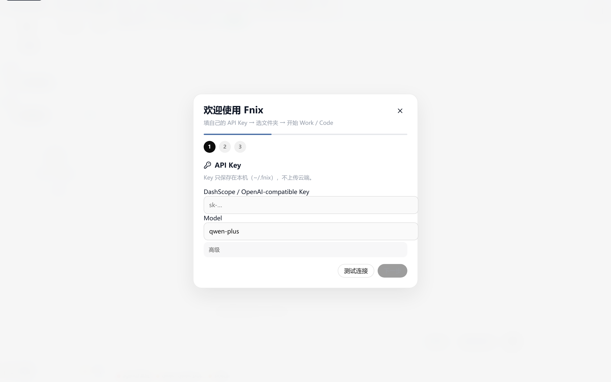

*图 1 首次引导向导界面 — 展示工作模式选择与 API Key 配置*

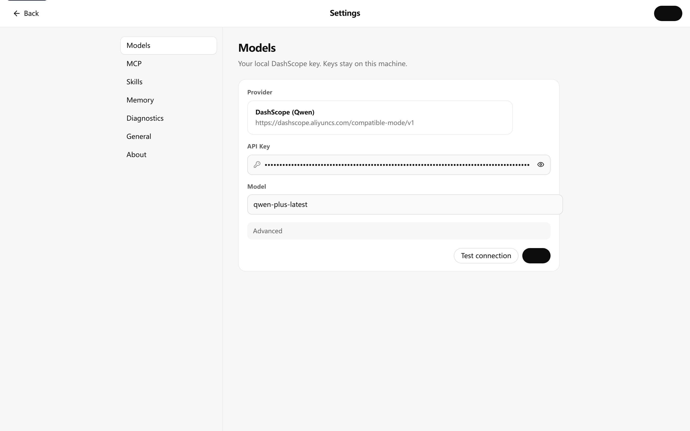

*图 2 API Key 配置界面 — 展示设置页面中 AI 标签页的 API Key 输入界面*

> **【截图位置 3-3】**：工作区文件夹选择对话框截图 — 展示文件选择窗口（需在 Tauri 桌面应用中手动截取）


*图 3 配置完成后的主工作台界面 — 展示 Work/Code 模式切换入口*

### 3.3 API Key 设置

FnixAgent 采用 BYOK 模式，用户需自行配置 LLM 服务的 API Key。提供以下两种配置方式：

#### 3.3.1 通过桌面应用设置（推荐）

1. 打开 FnixAgent 桌面应用
2. 点击左侧导航栏或顶部菜单中的 **设置（Settings）**
3. 进入 **AI** 标签页
4. 在"API 提供商"下拉菜单中选择 LLM 服务商（如 OpenAI、Qwen、GLM、DeepSeek 等）
5. 在"API Key"输入框中粘贴您的密钥
6. （可选）在"模型名称"中选择或输入具体模型（如 `gpt-4-turbo`、`qwen-plus`、`glm-4` 等）
7. （可选）如使用自定义兼容端点，填写"Base URL"地址
8. 点击"保存"

保存后，API Key 将加密存储在本机 `~/.fnix/config.toml` 文件中，不会上传至任何服务器。

#### 3.3.2 通过 CLI 命令设置

在终端中执行以下命令进行配置：

```bash
fnixagent setup
```

该命令将启动交互式配置向导，依次提示输入：
- LLM 提供商选择
- API Key 输入
- 模型名称选择
- （可选）自定义端点 URL

配置结果同样写入 `~/.fnix/config.toml`。

#### 3.3.3 通过环境变量设置（高级 / Headless 场景）

适用于 CLI 调试、服务器部署或自动化脚本场景。在项目根目录的 `.env` 文件中设置：

```bash
# 复制环境变量模板
cp .env.example .env

# 编辑 .env 文件，填入您的 API Key
DEEPSEEK_API_KEY=sk-your-deepseek-key
DASHSCOPE_API_KEY=sk-your-dashscope-key
OPENAI_API_KEY=sk-your-openai-key
GLM_API_KEY=your-glm-key
QWEN_API_KEY=your-qwen-key

# 自定义兼容端点
CUSTOM_API_KEY=your-custom-key
CUSTOM_BASE_URL=https://your-api-endpoint.com/v1
```

> **安全提示**：`.env` 文件已被 `.gitignore` 排除，不会被提交到版本控制。请勿将包含密钥的 `.env` 文件分享给他人。

#### 3.3.4 验证 API Key

配置完成后，可通过以下方式验证 API Key 是否生效：

- **桌面应用**：在 Work 模式中发送一条简单消息（如"你好"），如收到 LLM 回复，则配置成功。
- **CLI 命令**：

```bash
fnixagent chat
```

在终端对话中输入消息，如收到流式回复，则配置成功。

- **诊断命令**：

```bash
fnixagent doctor
```

该命令会检查 API Key 配置状态、后端服务连通性、fnix-local sidecar 状态等。

---

## 第四章 功能模块详述

### 4.1 Work 模式

Work 模式是 FnixAgent 面向办公任务的智能执行模块。用户通过自然语言描述任务需求，系统自动进行意图识别、任务规划、工具调用与产物生成，最终输出可下载的文件产物。

#### 4.1.1 功能概述

| 功能项 | 说明 |
|--------|------|
| 文档生成 | 生成 Word 文档（.docx），支持标题、段落、表格、页眉页脚、样式模板 |
| 表格生成 | 生成 Excel 表格（.xlsx），支持数据填充、公式计算、格式化 |
| PDF 生成 | 生成 PDF 报告，支持报告模板、简历模板、学术论文排版 |
| 图表生成 | 生成柱状图、折线图、饼图、散点图、热力图等数据可视化图表 |
| 格式转换 | docx/pdf/markdown/html/txt 多种格式互转 |
| 文档解析 | 解析 PDF/Word/图片中的表格、文字（含 OCR 多模态识别） |
| 学习辅助 | 论文摘要提取、智能问答、笔记生成、抽认卡制作 |
| 文献检索 | 通过 arXiv / Semantic Scholar / 知网等来源检索学术论文 |

#### 4.1.2 工作流程

Work 模式采用 **9 步流水线**（由 `services/work_pipeline.py` 实现，通过 `POST /api/v1/work/stream` 接口提供流式服务）：

```
用户输入任务描述
  │
  ▼
步骤 1：安全校验（SecurityEngine.check_input）
  │     检测敏感词、Prompt 注入攻击、越权请求
  │     ──检测到威胁──→ 拦截并返回安全提示
  ▼
步骤 2：短期记忆加载
  │     从 session 加载滑动窗口内的对话历史
  ▼
步骤 3：长期 / 实体记忆召回
  │     向量检索召回相关知识、读取用户画像与实体记忆
  ▼
步骤 4：推理模式选择（ReasoningSelector）
  │     根据任务复杂度自动选择：ReAct / Plan&Execute / Self-Reflection
  ▼
步骤 5：KTG 路径搜索 + STP 技能排序
  │     知识拓扑图路径搜索、技能突触权重驱动工具优先级
  ▼
步骤 6：AgenticLoop 工具执行（流式）
  │     循环执行：推理 → 选择工具 → 沙箱安全执行 → 观察结果
  ▼
步骤 7：反思提示注入（模式驱动）
  │     Self-Reflection 模式下注入反思提示，校验结果完整性
  ▼
步骤 8：输出审核 / 脱敏
  │     内容审核、敏感信息脱敏处理
  ▼
步骤 9：记忆保存 + MFP 进化 + KTG 快照 + TraceId 审计
  │     更新短期/长期/实体记忆、触发进化飞轮、记录审计日志
  ▼
输出产物（docx/xlsx/pdf 等）→ 保存至 {workspace}/.fnix/artifacts/
```

#### 4.1.3 界面操作

在桌面应用中，Work 模式界面包含以下区域：

- **任务输入区**：底部的文本输入框，用户输入自然语言任务描述
- **流式步骤展示区**：顶部步骤条，实时展示当前执行到流水线的哪一步（安全校验→记忆加载→推理→工具执行→反思→输出）
- **产物预览区**：中间区域，展示生成的文档、表格、图表等产物的预览
- **产物列表**：右侧或底部，列出本次会话生成的所有文件，支持点击下载或打开


*图 4 Work 模式主界面 — 展示任务输入区、侧边栏与会话列表*

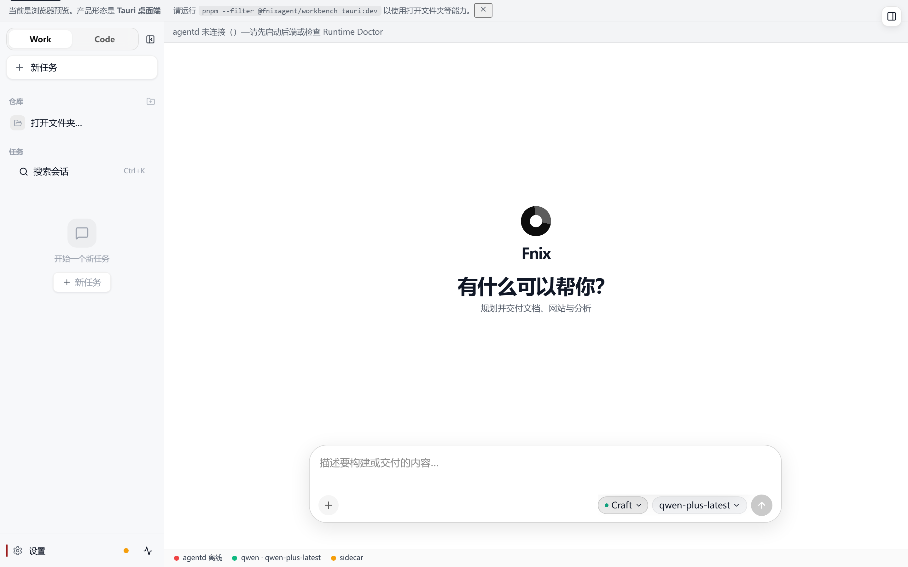

*图 5 Work 模式执行模式选择 — 展示 Ask/Plan/Craft 三种执行模式*

> **【截图位置 4-3】**：Work 模式产物生成截图 — 展示生成的文档预览与产物下载列表（需启动后端 API 后手动截取）

### 4.2 Code 模式

Code 模式是 FnixAgent 面向本地编程项目的智能辅助模块。与 Work 模式直接产出文件不同，Code 模式采用"**Diff 预览 → Accept 写盘**"的交互模式，确保用户对代码变更拥有完全的审查与控制权。

#### 4.2.1 功能概述

| 功能项 | 说明 |
|--------|------|
| Agent 规划 | 分析用户需求，自动生成代码修改计划与执行步骤 |
| 代码执行 | 按计划逐步执行代码修改、文件创建、重构等操作 |
| 代码审查 | Agent 自我对修改结果进行审查，检查逻辑正确性与代码质量 |
| `@file` 引用 | 使用 `@文件名` 语法在对话中引用项目文件，Agent 自动读取文件内容作为上下文 |
| Diff 预览 | 以差异视图展示代码变更（新增行/删除行/修改行），支持逐文件查看 |
| Accept 写盘 | 用户审查 Diff 后，点击"Accept"确认将修改写入磁盘文件 |
| PDG 上下文 | fnix-local 构建项目程序依赖图，为 Agent 提供精确的代码结构上下文 |
| 会话持久化 | Code 会话自动保存至 `~/.fnix/sessions/`，重启后可恢复 |

#### 4.2.2 工作流程

Code 模式通过 `POST /api/v1/chat/agent` 接口提供服务：

```
用户在 Code 模式输入需求（可使用 @file 引用文件）
  │
  ▼
Agent 接收请求 + PDG 上下文（来自 fnix-local 索引）
  │
  ▼
规划阶段：分析需求 → 生成修改计划（Plan）
  │     展示计划步骤给用户确认
  ▼
执行阶段：按计划逐步执行
  │     读取目标文件 → 生成修改 → 输出 Diff 预览
  ▼
审查阶段：Agent 自动审查修改
  │     检查语法正确性、逻辑一致性、潜在副作用
  ▼
用户确认：查看 Diff 预览
  │     ├── Accept → 写入磁盘文件
  │     └── Reject → 放弃修改
  ▼
会话保存：session 持久化至 ~/.fnix/sessions/
```

#### 4.2.3 `@file` 引用语法

在 Code 模式的对话输入中，使用 `@` 符号引用项目文件：

```
请帮我重构 @src/main.py 中的数据库连接逻辑，使用连接池替代直接连接
```

- 输入 `@` 后，系统自动弹出文件选择列表，支持模糊搜索
- 选中文件后，Agent 自动读取该文件的完整内容作为上下文
- 支持同时引用多个文件：`@src/main.py @src/config.py`
- 支持目录引用：`@src/utils/`（引用整个目录下的文件）

#### 4.2.4 界面操作

Code 模式界面采用三栏布局：

- **左侧栏 — 文件树**：展示当前工作区的文件目录结构，支持文件搜索与导航
- **中间栏 — 对话与 Diff**：上半部分为 Agent 对话区（显示规划、执行、审查过程），下半部分为 Diff 预览区（以 Monaco Editor 渲染代码差异）
- **右侧栏 — 终端与会话**：内置本地终端（xterm.js），支持直接执行命令；会话历史列表

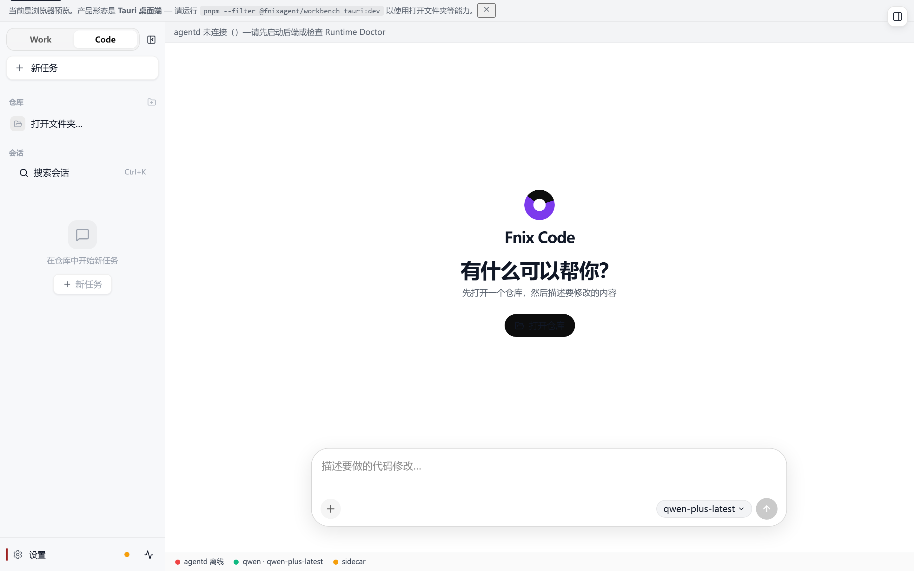

*图 6 Code 模式界面 — 展示 Code 模式主界面与任务输入区*

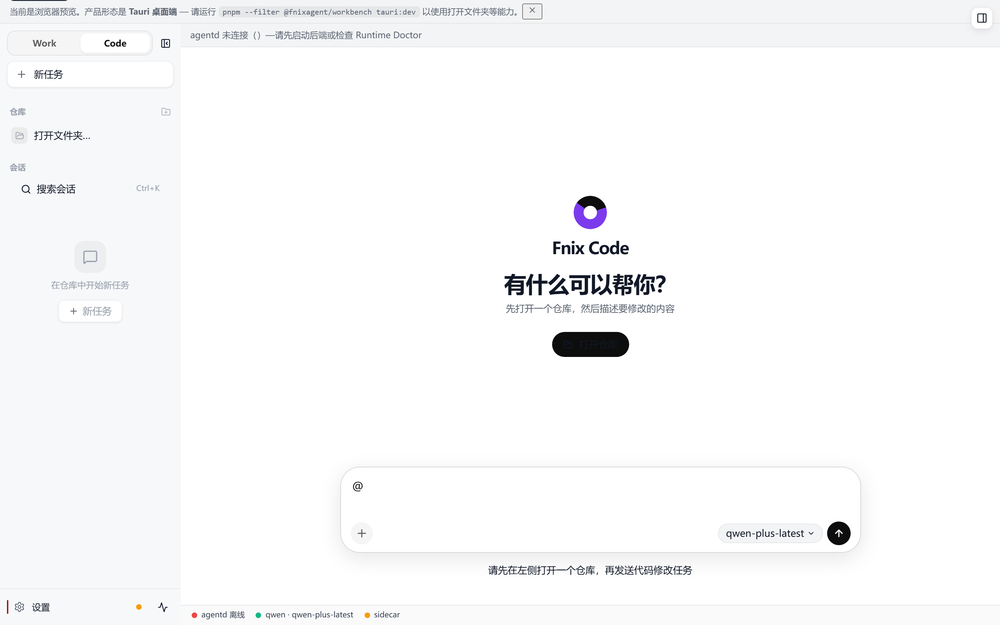

*图 7 Code 模式 @file 引用 — 展示输入 @ 后弹出的文件选择列表*

> **【截图位置 4-6】**：Code 模式 Diff 预览截图 — 展示代码差异视图（绿色新增行、红色删除行）与 Accept/Reject 按钮（需启动后端 API 并打开项目后手动截取）

### 4.3 Harness 管理

Harness 是 FnixAgent 的基础设施管理层，负责会话持久化、工作区管理、MCP 配置与项目技能管理。

#### 4.3.1 会话持久化

所有 Work 与 Code 任务的会话记录均自动持久化至本地文件系统：

- **存储位置**：`~/.fnix/sessions/*.json`
- **存储内容**：每条会话记录包含会话 ID、模式（work/code）、创建时间、对话消息（含用户输入与 Agent 输出）、工具调用记录、产物列表、任务状态等
- **会话恢复**：重启应用后，通过 `GET /api/v1/work/sessions` 获取历史会话列表，可选择恢复任一会话继续工作
- **会话隔离**：不同工作区的会话相互独立，不会交叉

#### 4.3.2 工作区管理

打开工作区文件夹时，系统自动执行以下操作：

1. 调用 `POST /api/v1/harness/workspace/ensure` 初始化项目 `.fnix/` 目录结构
2. 调用 `POST /api/v1/harness/index` 触发 fnix-local 构建项目文件索引（PDG）
3. 加载 `.fnix/skills/` 目录下的项目技能文件
4. 读取 `.fnix/rules.md` 项目规则文件（兼容 AGENTS.md 规范）

#### 4.3.3 MCP 配置

MCP（Model Context Protocol）是一种标准化的模型上下文协议，FnixAgent 支持通过 MCP 扩展 Agent 的工具能力：

- **配置位置**：`~/.fnix/mcp.json`
- **配置方式**：通过桌面应用 Settings → MCP 页面添加 MCP Server，或手动编辑 `mcp.json` 文件
- **API 接口**：
  - `GET /api/v1/harness/mcp` — 获取当前 MCP 配置
  - `PUT /api/v1/harness/mcp` — 更新 MCP 配置
- **热加载**：修改 MCP 配置后无需重启，通过 `POST /api/v1/harness/skills/reload` 热加载

#### 4.3.4 项目技能（Skills）

项目技能是以 Markdown 文件形式存储的项目特定指令与知识，存储于 `{workspace}/.fnix/skills/` 目录下：

- **技能文件格式**：Markdown 文件（`.md`），包含技能名称、描述、触发条件、执行指令等
- **加载机制**：打开工作区时自动加载，通过 STP（技能突触协议）注入 Agent 的推理过程
- **热加载**：通过 `POST /api/v1/harness/skills/reload` 或界面操作触发技能热加载，无需重启应用
- **API 接口**：`GET /api/v1/harness/skills?workspace={path}` — 列出指定工作区的所有技能

#### 4.3.5 Harness 状态查询

通过 API 查询当前 Harness 与 sidecar 的运行状态：

```
GET /api/v1/harness/status
```

返回信息包括：
- agentd 服务状态（运行中/离线）
- fnix-local sidecar 状态（运行中/离线/降级模式）
- 当前工作区路径
- 已加载技能数量
- MCP Server 连接状态


*图 8 诊断页面 — 展示系统运行状态检查界面*


*图 9 Harness 状态查询 — 展示 agentd 服务状态、fnix-local sidecar 状态等信息*


*图 10 设置页面 — 展示 Settings 页面的 AI 配置、模型管理等标签页*

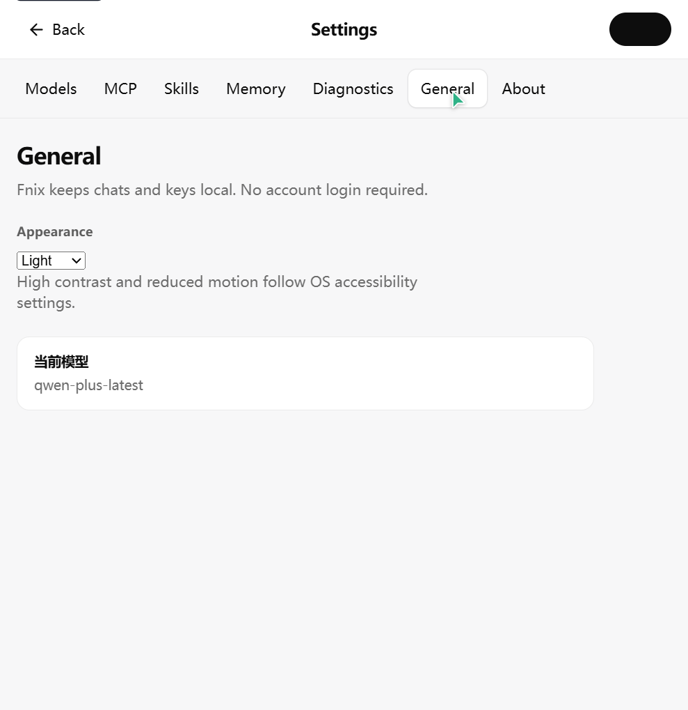

*图 11 设置 — 通用配置标签页*

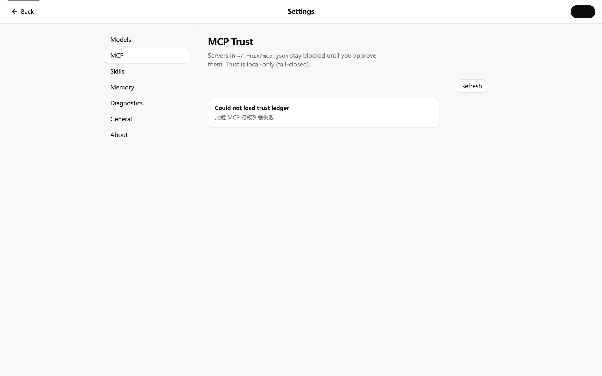

*图 12 设置 — MCP 配置标签页*

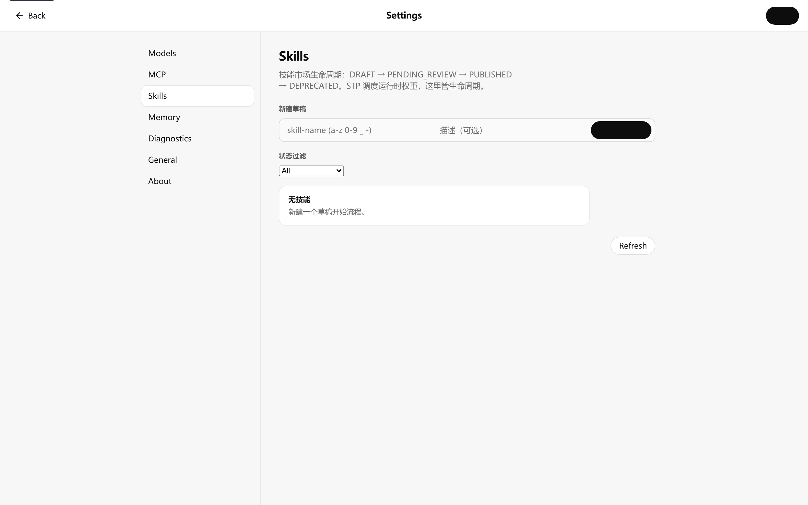

*图 13 设置 — 技能管理标签页*

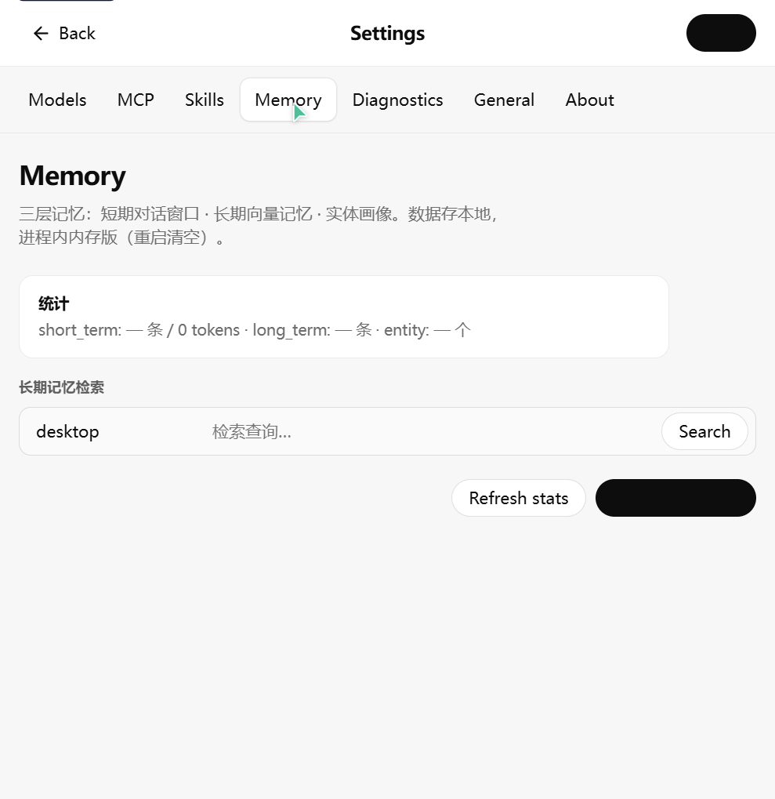

*图 14 设置 — 记忆管理标签页*

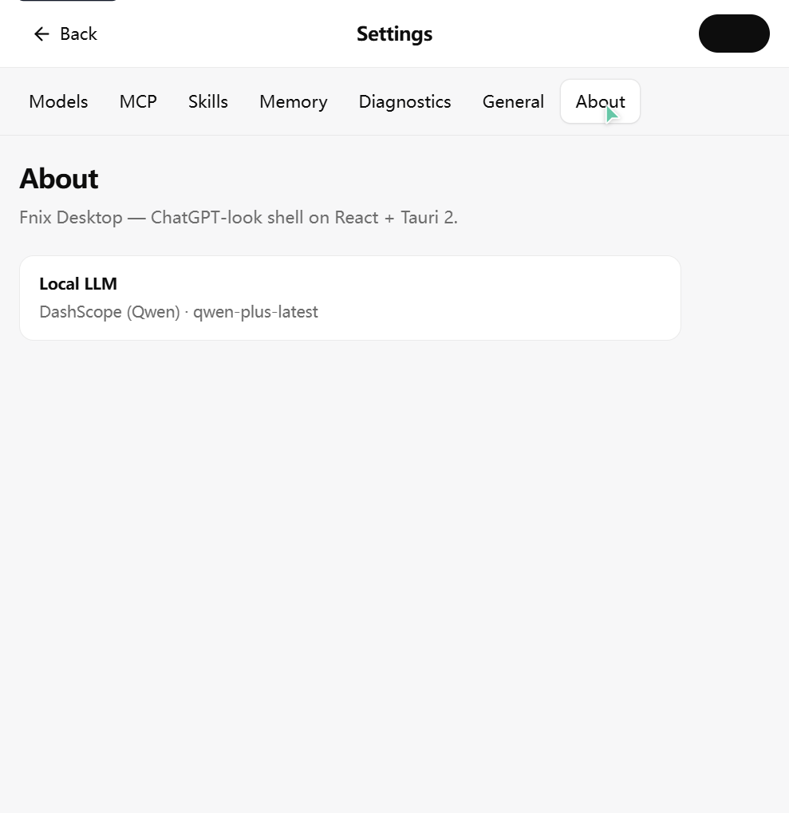

*图 15 设置 — 关于标签页*

### 4.4 安全机制

FnixAgent 构建了**六道安全关卡**的纵深防御体系，覆盖从输入到输出的全链路安全管控。

#### 4.4.1 安全关卡总览

```
用户输入
  │
  ▼
关卡 1：网关鉴权（JWT）
  │     验证请求合法性，拒绝未授权访问
  ▼
关卡 2：输入安全引擎
  │     敏感词检测 + Prompt 注入攻击防护
  │     配置：config/security/sensitive_words.yaml
  ▼
关卡 3：工具权限分级
  │     工具按权限等级分类（low/middle/high）
  │     high 级别工具需额外确认
  ▼
关卡 4：沙箱隔离执行
  │     动态代码在安全沙箱中执行
  │     限制文件系统访问范围与系统调用
  ▼
关卡 5：输出审核
  │     内容审核（合规性检查）
  │     敏感信息脱敏（邮箱/手机号/身份证号等）
  ▼
关卡 6：审计落库
  │     全链路 TraceId 追踪
  │     所有工具调用与安全事件记录到审计日志
  ▼
输出返回用户
```

#### 4.4.2 JWT 鉴权

- **算法**：HS256（HMAC-SHA256）
- **令牌有效期**：默认 24 小时（可通过 `JWT_EXPIRATION_HOURS` 配置）
- **密钥管理**：本地开发可使用默认密钥；公开部署必须修改 `JWT_SECRET_KEY`
- **桌面应用**：Desktop 启动时自动获取 JWT 令牌，用户无感知

#### 4.4.3 注入防护

- **Prompt 注入检测**：检测用户输入中是否包含试图操纵 LLM 行为的注入指令
- **最大尝试限制**：默认 3 次，超出后暂时封禁
- **配置**：`config/settings.yaml` 中 `security.injection_protection` 段

#### 4.4.4 沙箱执行

- **启用状态**：默认启用
- **执行超时**：默认 10000 毫秒（10 秒）
- **网络白名单**：仅允许访问预配置的域名（如 arxiv.org、semanticscholar.org 等学术资源站点）
- **文件系统限制**：工具仅可访问工作区目录范围内的文件
- **配置**：`config/settings.yaml` 中 `tools.sandbox` 段

#### 4.4.5 敏感词检测

- **检测级别**：支持 low / medium / high 三级（默认 medium）
- **词库分类**：政治、暴力、色情、赌博、毒品、欺诈、广告、侮辱共 8 大类
- **配置文件**：`config/security/sensitive_words.yaml`

#### 4.4.6 数据脱敏

- **默认启用**
- **脱敏模式**：
  - 邮箱地址（email）
  - 手机号码（phone）
  - 身份证号码（id_card）
- **配置**：`config/settings.yaml` 中 `security.desensitize` 段

#### 4.4.7 加密体系

FnixAgent 采用三层加密算法保护敏感数据：

| 加密用途 | 算法 | 说明 |
|---------|------|------|
| 密码哈希 | Argon2id | 抗 GPU/ASIC 破解的现代密码哈希算法 |
| 非对称加密 | RSA | 用于密钥交换与数字签名 |
| 对称加密 | AES-256-GCM | 用于本地数据加密存储，含完整性验证 |
| 密钥派生 | PBKDF2-SHA256 | 迭代 100,000 次，派生 256 位密钥 |

### 4.5 自进化内核

自进化内核是 FnixAgent 区别于传统 LLM Agent 的核心差异化能力，由三大原创机制构成：

#### 4.5.1 KTG（Knowledge Topology Graph）— 知识拓扑图

KTG 是一种四层知识拓扑结构，通过权重路径搜索替代传统的纯向量 RAG（检索增强生成）方式。

| 配置项 | 默认值 | 说明 |
|--------|--------|------|
| 路径搜索 Top-K | 3 | 路径搜索返回的前 K 条最优路径 |
| 最大搜索深度 | 6 | 路径展开的最大深度 |
| 路径剪枝阈值 | 0.05 | 权重低于此值的路径被剪枝 |
| 冷启动阈值 | 5 | 冷启动判定阈值（使用次数低于此值视为冷启动） |

**工作原理**：
1. 构建四层知识拓扑图（概念层、技能层、工具层、资源层）
2. 节点间通过带权重的边连接，权重反映关联强度
3. 用户输入查询时，在拓扑图中执行路径搜索，返回最优路径上的相关知识
4. 拓扑图快照持久化至 `data/topology/` 目录

#### 4.5.2 STP（Skill-Topology Synapse Protocol）— 技能突触协议

STP 建立 L2 概念层与技能之间的突触连接，通过权重驱动工具的优先级排序。

| 配置项 | 默认值 | 说明 |
|--------|--------|------|
| 技能绑定配置文件 | `config/skill_bindings.yaml` | 技能与拓扑节点的绑定关系 |
| 默认权限级别 | basic | 技能的默认权限等级 |
| 推理需确认 | true | 推理类操作需用户确认 |
| 元操作需授权 | true | 元操作（修改自身配置）需用户授权 |

#### 4.5.3 MFP（Multi-stage Flywheel Protocol）— 四阶进化飞轮

MFP 是一个四阶段的持续进化循环，在用户日常使用过程中自动运行：

| 阶段 | 名称 | 触发条件 | 说明 |
|------|------|---------|------|
| 阶段 1 | 感知执行（Perception） | 每次对话 | 实时感知用户意图与任务执行结果，最大迭代 5 次 |
| 阶段 2 | 知识固化（Knowledge） | 每次对话 | 将感知到的知识固化为拓扑图节点与边，过滤垃圾信息 |
| 阶段 3 | 元反思（Reflection） | 每 10 次对话 | 元层面反思近期表现，识别改进空间 |
| 阶段 4 | 爬山进化（Climbing） | 每 50 次对话 | 爬山算法优化拓扑权重与技能排序，进化前自动快照 |

**持久化资产目录**：

| 目录 | 用途 |
|------|------|
| `assets/topology/` | KTG 拓扑图快照 |
| `assets/skills/` | STP 技能库 |
| `assets/flywheel/` | MFP 飞轮状态 |
| `assets/traces/` | 进化轨迹记录 |
| `assets/snapshots/` | 进化前快照 |
| `assets/prompts/` | 进化产生的 Prompt 变体 |
| `assets/meta/` | 元数据（版本信息等） |

> 所有持久化资产均启用 AES-256-GCM 加密存储，密钥通过 PBKDF2-SHA256 派生（100,000 次迭代）。

### 4.6 AG-UI 事件流

AG-UI（Agent-UI）是 FnixAgent 的实时事件流推送机制，基于 Server-Sent Events（SSE）协议实现。

#### 4.6.1 事件流接口

```
POST /api/v1/ag-ui/work/stream
```

该接口返回 NDJSON（Newline Delimited JSON）格式的流式事件，前端实时渲染 Agent 的执行过程。

#### 4.6.2 事件类型

| 事件类型 | 说明 |
|---------|------|
| `evolution` | 自进化内核状态更新（KTG/STP/MFP 状态变化） |
| `pipeline` | 流水线步骤变更（安全校验→记忆加载→推理→...） |
| `thought` | Agent 思考过程（推理步骤、中间结论） |
| `action` | 工具调用动作（工具名称、参数、执行状态） |
| `artifact` | 产物生成事件（文件名、类型、预览数据） |
| `done` | 任务完成事件（最终结果、统计信息） |

#### 4.6.3 前端渲染

桌面应用前端通过 EventSource 或 fetch 流式读取 NDJSON 事件，实时更新界面：
- 步骤条展示当前流水线进度
- 思考过程以打字机效果逐字显示
- 工具调用以卡片形式展示参数与结果
- 产物生成后立即在预览区展示

---

## 第五章 操作流程

### 5.1 典型使用场景

#### 场景一：生成周报 Word 文档（Work 模式）

用户需要根据本周工作内容生成一份格式规范的 Word 周报文档。

#### 场景二：生成数据分析图表与 Excel 表格（Work 模式）

用户提供一组数据，需要生成可视化图表并导出为 Excel 表格。

#### 场景三：重构项目代码（Code 模式）

用户有一个 Python 项目，需要将某模块的同步数据库调用改为异步连接池方式。

#### 场景四：修复 Bug（Code 模式）

用户在项目中遇到一个 Bug，通过描述问题让 Agent 定位并修复。

#### 场景五：生成 PDF 报告（Work 模式）

用户需要将一段 Markdown 内容转换为格式精美的 PDF 报告。

### 5.2 操作步骤

以下以"生成周报 Word 文档"和"重构项目代码"两个典型场景为例，详述操作步骤。

#### 5.2.1 Work 模式操作步骤 — 生成周报 Word 文档

**步骤 1：启动应用并选择工作区**

启动 FnixAgent 桌面应用。如首次使用，完成首次引导配置（参见第三章）。在界面左上角确认当前工作区文件夹路径正确。

**步骤 2：切换至 Work 模式**

在界面顶部模式切换栏中，点击 **"Work"** 按钮切换至办公任务模式。

**步骤 3：输入任务描述**

在底部任务输入框中输入自然语言描述，例如：

```
请帮我生成本周工作周报的 Word 文档。本周完成的工作包括：
1. 完成了用户登录模块的开发与测试
2. 修复了 3 个线上 Bug（编号 #101、#102、#103）
3. 参加了周三的技术评审会议
4. 编写了 API 接口文档

周报格式要求：包含标题、日期、本周工作总结、下周计划、问题与风险四个部分。
```

**步骤 4：观察执行过程**

点击发送后，界面顶部步骤条开始展示执行进度：

1. **安全校验** — 系统检测输入安全性（绿色对勾表示通过）
2. **记忆加载** — 加载历史会话上下文
3. **推理规划** — Agent 分析任务，选择推理模式与工具
4. **工具执行** — 调用 Word 文档生成工具（python-docx），实时展示执行状态
5. **反思校验** — 检查文档结构完整性与内容质量
6. **输出审核** — 审核输出内容合规性
7. **产物生成** — 文档生成完成

**步骤 5：查看与下载产物**

执行完成后，产物预览区展示生成的 Word 文档预览。右侧产物列表中出现 `weekly_report.docx` 文件。点击文件名可：
- **预览**：在应用内查看文档内容
- **打开**：使用系统默认应用打开文件
- **在文件夹中显示**：打开文件所在目录（`{workspace}/.fnix/artifacts/`）

**步骤 6：继续对话（可选）**

如需修改文档，可在输入框中继续对话：

```
请在周报中增加一个"学习成长"部分，记录本周学习的新技术。
```

Agent 将基于已有上下文继续修改文档。

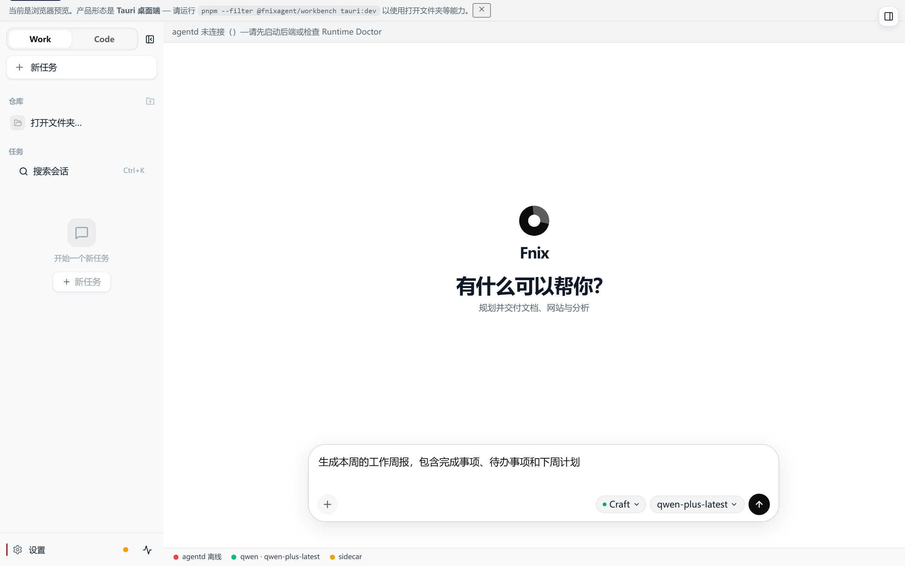

*图 16 Work 模式任务输入 — 展示周报生成任务的输入界面*

> **【截图位置 5-2】**：Work 模式产物下载截图 — 展示产物列表中的文件下载/打开操作（需启动后端 API 执行任务后手动截取）

#### 5.2.2 Code 模式操作步骤 — 重构项目代码

**步骤 1：打开项目工作区**

启动 FnixAgent，在文件菜单中选择"打开文件夹"，选择您的项目根目录。系统自动初始化 `.fnix/` 目录并构建项目索引（PDG）。

**步骤 2：切换至 Code 模式**

在界面顶部模式切换栏中，点击 **"Code"** 按钮切换至编程辅助模式。

**步骤 3：使用 @file 引用目标文件**

在对话输入框中输入需求并引用相关文件：

```
请帮我重构 @src/database/connection.py 中的数据库连接逻辑。
当前使用的是直接连接方式（每次请求创建新连接），请改为使用连接池。
推荐使用 SQLAlchemy 的连接池实现。
```

输入 `@` 后，系统弹出文件选择列表，输入 `connection` 模糊搜索并选中目标文件。

**步骤 4：查看 Agent 规划**

Agent 接收请求后，首先展示修改计划：

```
修改计划：
1. 分析当前 connection.py 中的连接逻辑
2. 引入 SQLAlchemy create_engine 与连接池配置
3. 将直接连接替换为连接池获取连接
4. 更新连接关闭逻辑（改为归还连接池而非关闭连接）
5. 添加连接池参数配置（池大小、超时等）
```

**步骤 5：审查 Diff 预览**

Agent 执行修改后，界面下方 Diff 预览区以差异视图展示代码变更：

- 绿色背景行 — 新增代码
- 红色背景行 — 删除代码
- 可逐文件切换查看

**步骤 6：Accept 写盘**

审查 Diff 后：
- 确认无误 → 点击 **"Accept"** 按钮，修改写入磁盘文件
- 需要调整 → 点击 **"Reject"** 按钮，放弃修改并继续对话调整

**步骤 7：验证修改**

在右侧终端面板中运行测试命令验证修改：

```bash
python -m pytest tests/test_database.py -v
```

> **【截图位置 5-3】**：Code 模式重构完整流程截图 — 包含 @file 引用输入、Agent 规划展示、Diff 预览、Accept 写盘（需启动后端 API 并打开项目后手动截取）
>
> **【截图位置 5-4】**：Code 模式终端验证截图 — 展示右侧终端面板中运行测试命令的输出结果（需启动后端 API 并打开项目后手动截取）

#### 5.2.3 CLI 操作步骤 — 终端对话

除桌面应用外，FnixAgent 还提供 CLI 命令行工具，适合无图形界面的服务器环境或自动化脚本场景。

**启动终端对话**

```bash
fnixagent chat
```

进入交互式对话模式后，直接输入消息与 Agent 交互，支持流式输出。

**启动 Web 管理台**

```bash
fnixagent dashboard
```

该命令在本地启动 Web 管理台（默认地址 `http://127.0.0.1:9119`），可在浏览器中管理配置、查看会话历史、监控服务状态。

**运行诊断**

```bash
fnixagent doctor
```

诊断命令检查以下项目并输出报告：
- Node.js / pnpm / Python / Rust 版本与可用性
- agentd 后端服务连通性（端口 8003）
- fnix-local sidecar 连通性（端口 8710）
- API Key 配置状态
- 工作区 `.fnix/` 目录初始化状态
- 磁盘空间检查

---

## 第六章 常见问题与故障排除

### 6.1 安装与启动问题

#### Q1：Windows 安装时提示"无法验证发布者"或被 SmartScreen 拦截

**原因**：FnixAgent 为专有软件，安装包未经微软商业代码签名认证。

**解决方案**：在 SmartScreen 提示窗口中，点击"更多信息" → "仍要运行"即可继续安装。

#### Q2：macOS 安装后提示"无法打开，因为无法验证开发者"或"应用已损坏"

**原因**：macOS Gatekeeper 安全机制限制未签名应用。

**解决方案**：
- 方法一：右键点击应用图标 → 选择"打开" → 在弹窗中点击"打开"
- 方法二：系统偏好设置 → 安全性与隐私 → 点击"仍要打开"
- 方法三：终端执行 `xattr -cr /Applications/FnixAgent.app`

#### Q3：从源码构建时 Tauri 编译失败

**原因**：缺少 Rust 工具链或 Windows Build Tools。

**解决方案**：
- 确认已安装 Rust stable：执行 `rustc --version`
- Windows 用户需安装 Visual Studio Build Tools（含"使用 C++ 的桌面开发"工作负载）
- 运行 `pnpm doctor` 检查环境完整性

#### Q4：启动后桌面窗口白屏或无法加载

**原因**：WebView2 Runtime 缺失（Windows）或后端服务未启动。

**解决方案**：
- Windows：安装 [WebView2 Runtime](https://developer.microsoft.com/microsoft-edge/webview2/)
- 从源码运行时确认三进程已启动：`pnpm dev:all`
- 检查后端健康：浏览器访问 `http://127.0.0.1:8003/health`

### 6.2 API Key 与 LLM 相关问题

#### Q5：发送消息后无响应或提示"API Key 无效"

**原因**：API Key 未配置、配置错误或已过期。

**解决方案**：
- 打开 设置 → AI，确认已选择正确的 LLM 提供商并填入了有效的 API Key
- 运行 `fnixagent doctor` 检查 API Key 配置状态
- 确认 API Key 未过期且有足够余额
- 如使用自定义端点，确认 Base URL 正确且服务可用

#### Q6：LLM 响应缓慢或频繁超时

**原因**：网络延迟高、LLM 服务负载高或模型配置不当。

**解决方案**：
- 检查网络连接稳定性
- 尝试切换到响应更快的模型（如从 GPT-4 切换到 GPT-4-turbo 或 Qwen-plus）
- 检查 `config/settings.yaml` 中 `llm.router.timeout_ms` 配置（默认 30000 毫秒），适当增大
- 如使用 vLLM 自部署，确认 GPU 资源充足

#### Q7：不同 LLM 提供商的 API Key 可以同时配置多个吗

**回答**：可以。FnixAgent 支持多提供商配置，在 `config/settings.yaml` 的 `llm.providers` 中可配置多个提供商。系统支持自动路由与故障转移（fallback），默认提供商不可用时自动切换到备用提供商。

### 6.3 功能使用问题

#### Q8：Work 模式生成的文件保存在哪里

**回答**：Work 模式的产物默认保存在 `{workspace}/.fnix/artifacts/` 目录下。用户也可在任务描述中指定输出路径。

#### Q9：Code 模式修改代码后会自动写入磁盘吗

**回答**：不会。Code 模式采用"Diff 预览 → Accept 写盘"的安全模式。Agent 生成代码修改后，仅在界面中展示差异预览，必须由用户点击"Accept"按钮确认后才会写入磁盘。用户可随时点击"Reject"放弃修改。

#### Q10：`@file` 引用的文件有大小限制吗

**回答**：单个文件建议不超过 1 MB（约 25,000 行代码），过大的文件可能导致 LLM 上下文溢出。对于大型文件，建议引用关键片段或使用 fnix-local 的 PDG 索引功能获取结构化上下文。

#### Q11：会话历史会丢失吗

**回答**：不会。所有 Work 与 Code 会话均自动持久化至 `~/.fnix/sessions/` 目录。重启应用后，可通过会话列表恢复历史会话。如需清理历史会话，可手动删除该目录下的 JSON 文件。

### 6.4 性能与资源问题

#### Q12：C 盘磁盘空间被占满

**原因**：FnixAgent 编译缓存（`%TEMP%\fnix-sandbox-cache`）可能占用数十 GB 空间。

**解决方案**：

```bash
# 基础清理
pnpm clean:cache

# 深度清理（含 npm/pip/cargo 缓存 + 3 天前的临时文件）
pnpm clean:cache:aggressive
```

或手动删除以下目录中的缓存文件：
- Windows: `C:\Users\<用户名>\AppData\Local\Temp\fnix-sandbox-cache`
- macOS/Linux: `/tmp/fnix-sandbox-cache`

#### Q13：fnix-local sidecar 离线后还能使用吗

**回答**：可以。fnix-local 离线时，Work/Code 功能可降级使用 Python 内置工具继续运行，但以下功能将受限：
- 项目文件索引（PDG）不可用，Code 模式上下文精度降低
- 沙箱命令执行不可用，部分工具调用可能失败
- 通过 `pnpm stack:sidecar` 可尝试重新启动 sidecar

#### Q14：内存占用过高

**原因**：大型项目索引、多会话并行或缓存数据过多。

**解决方案**：
- 关闭不使用的会话标签页
- 对于大型项目，建议增加物理内存至 16 GB 以上
- 定期运行 `pnpm clean:cache` 清理缓存

### 6.5 故障排除速查表

| 问题现象 | 可能原因 | 解决方案 |
|---------|---------|---------|
| 桌面窗口无法打开 | WebView2 缺失 / 后端未启动 | 安装 WebView2 / 运行 `pnpm dev:all` |
| 后端离线（端口 8003） | agentd 进程未启动 | 运行 `pnpm dev:api` 或检查端口占用 |
| 无 LLM 响应 | API Key 未配置或无效 | 设置 → AI 检查 API Key / 运行 `fnixagent doctor` |
| fnix-local 离线 | sidecar 进程未启动 | Work/Code 仍可用 Python fallback / `pnpm stack:sidecar` |
| Code 模式索引慢 | 项目过大 / 首次索引 | 等待索引完成 / 增加内存配置 |
| 磁盘空间不足 | 编译缓存占用 | `pnpm clean:cache:aggressive` |
| JWT 认证失败 | 密钥过期 / 配置错误 | 重启应用 / 检查 `JWT_SECRET_KEY` 配置 |
| MCP Server 连接失败 | MCP 配置错误 / 服务未启动 | 检查 `~/.fnix/mcp.json` / `GET /api/v1/harness/status` |

---

## 第七章 技术支持信息

### 7.1 软件信息

| 项目 | 信息 |
|------|------|
| 软件名称 | FnixAgent 智能工作台系统 |
| 软件版本 | V1.0 |
| 软件许可 | 专有软件许可（详见 LICENSE 文件） |
| 软件仓库 | https://github.com/Liuyifeidashuaibi/FnixAgent |
| 官方 Releases | https://github.com/Liuyifeidashuaibi/FnixAgent/releases |
| 技术栈 | Tauri 2 + Python 3.11 + React 19 + FastAPI |

### 7.2 CLI 命令速查

| 命令 | 功能说明 |
|------|---------|
| `fnixagent setup` | 配置 API Key 与模型（交互式向导） |
| `fnixagent doctor` | 环境诊断与健康检查 |
| `fnixagent dashboard` | 启动 Web 管理台（http://127.0.0.1:9119） |
| `fnixagent chat` | 启动终端对话模式 |

### 7.3 开发命令速查

| 命令 | 功能说明 |
|------|---------|
| `pnpm setup` | 安装项目全部依赖 |
| `pnpm doctor` | 检查开发环境完整性 |
| `pnpm dev:all` | 启动三进程开发模式（Tauri + agentd + fnix-local） |
| `pnpm dev` | 启动 Tauri Desktop（自动 spawn 后端） |
| `pnpm build` | 构建生产版本安装包 |
| `pnpm verify:beta` | 发布前验收（pytest + typecheck + 计划检查） |
| `pnpm e2e:full` | Harness API 端到端测试 |
| `pnpm clean:cache` | 清理开发缓存 |
| `pnpm clean:cache:aggressive` | 深度清理（含 npm/pip/cargo 缓存） |

### 7.4 API 接口速查

| 方法 | 路径 | 功能说明 |
|------|------|---------|
| GET | `/health` | 后端健康检查 |
| GET | `/api/v1/harness/status` | 查询 Harness 与 sidecar 状态 |
| POST | `/api/v1/harness/workspace/ensure` | 初始化工作区 `.fnix` 目录 |
| POST | `/api/v1/harness/index` | 触发项目 PDG 索引 |
| GET | `/api/v1/harness/skills?workspace=` | 列出工作区技能 |
| POST | `/api/v1/harness/skills/reload` | 热加载技能 |
| GET / PUT | `/api/v1/harness/mcp` | 获取 / 更新 MCP 配置 |
| GET | `/api/v1/work/sessions` | 获取会话历史列表 |
| GET | `/api/v1/work/sessions/{id}` | 获取单个会话详情 |
| POST | `/api/v1/work/stream` | Work 模式流式任务执行 |
| POST | `/api/v1/chat/agent` | Code 模式流式 Agent |
| POST | `/api/v1/ag-ui/work/stream` | AG-UI SSE 事件流 |

### 7.5 文档资源

| 文档名称 | 路径 | 说明 |
|---------|------|------|
| 快速上手 | `docs/QUICKSTART.md` | 5 分钟快速开始指南 |
| 安装指南 | `docs/INSTALL.md` | 详细安装与运行指南 |
| 架构设计 | `docs/internal/ARCHITECTURE_LOCAL_HARNESS.md` | 三进程 Harness 架构详解 |
| 自进化内核 | `docs/internal/EVOLUTION_CORE.md` | KTG/STP/MFP 机制详解 |
| 产品设计 | `docs/FNIX_PRODUCT.md` | 产品定位与设计方案 |
| 部署设计 | `docs/internal/RELEASE_DESIGN.md` | 用户部署与分发方案 |
| 贡献指南 | `CONTRIBUTING.md` | 开发环境与 PR 流程 |
| 安全策略 | `SECURITY.md` | 漏洞报告与安全加固 |
| 仓库结构 | `docs/STRUCTURE.md` | Monorepo 目录结构规范 |

### 7.6 社区与反馈

| 渠道 | 地址 | 用途 |
|------|------|------|
| GitHub Issues | https://github.com/Liuyifeidashuaibi/FnixAgent/issues | Bug 报告与功能建议 |
| GitHub Discussions | https://github.com/Liuyifeidashuaibi/FnixAgent/discussions | 技术讨论与问答 |
| 安全邮箱 | security@fnixagent.dev | 安全漏洞报告（请勿在公开 Issue 中报告安全漏洞） |
| 行为准则 | CODE_OF_CONDUCT.md | 社区行为规范 |

### 7.7 安全漏洞报告

如发现安全漏洞，请遵循协调漏洞披露（CVD）原则：

1. 发送邮件至 security@fnixagent.dev，主题以 `[SECURITY]` 前缀开头
2. 如内容敏感，请使用 PGP 公钥加密邮件（公钥可在 keys.openpgp.org 搜索 `security@fnixagent.dev`）
3. 提供漏洞类型、受影响文件路径、复现步骤、PoC 代码、影响评估等信息
4. 等待确认（24 小时内回复确认收到）

响应时间承诺：

| 阶段 | 时间窗口 |
|------|---------|
| 收到确认 | 24 小时内 |
| 初步评估 | 7 天内 |
| 修复发布 | 90 天内（严重漏洞优先 30 天内） |
| 公开披露 | 修复后 14 天 |

---

*本手册版权归 FnixAgent 项目所有。未经许可，不得复制、传播或用于商业用途。*

*FnixAgent 智能工作台系统 V1.0 用户手册 — 完*
